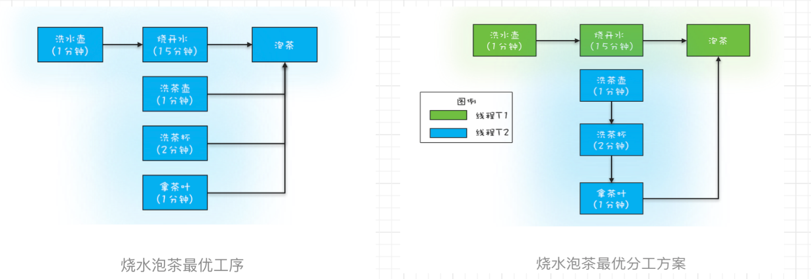
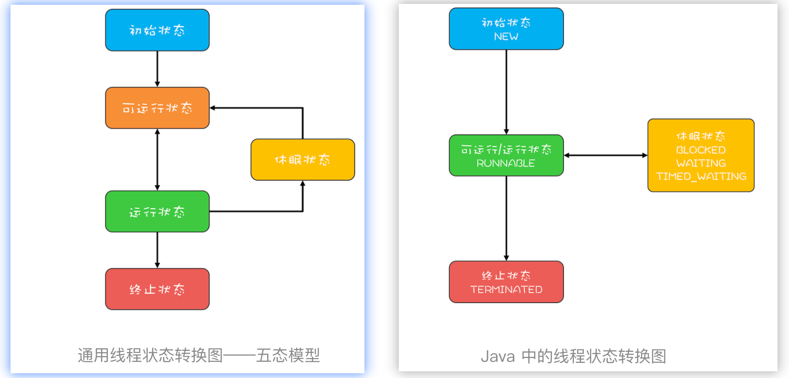
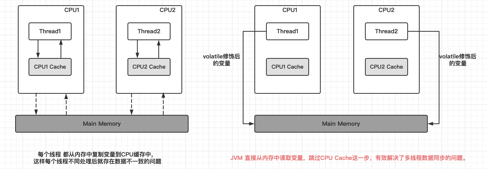
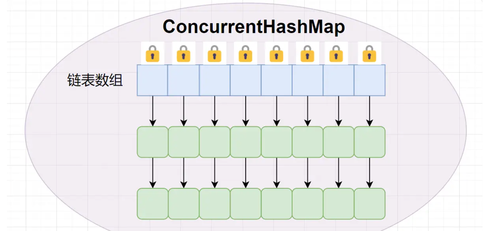
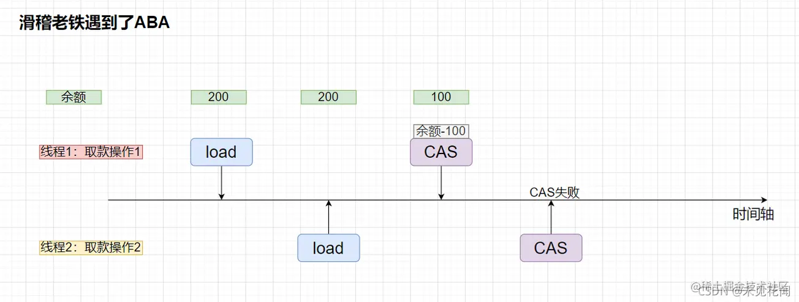
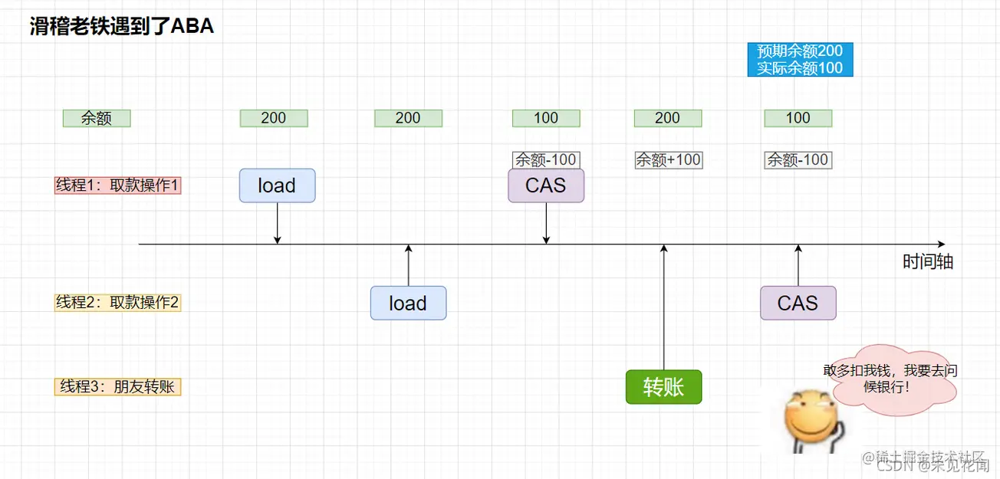
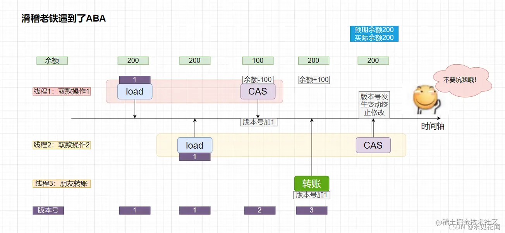

# 写在前面


## 推荐

### 视频

黑马


### 书籍

《offer来了》第三章 Java 并发编程

```bash
相对于传统的单线程，多线程能够在操作系统多核配置的基础上，能够更好地利用服务器的多个CPU资源，使程序运行起来更加高效。

Java 通过提供对多线程的支持，在一个进程内并发执行多个线程，每个线程都并行执行不同的任务，以满足编写高并发程序的要求。
```

### 博客

极客时间

[Java多线程之锁优化与JUC常用类](https://juejin.cn/post/7106118341970493476#heading-8)


## 总结

java中的 JUC 就是来自`java.util.concurrent`包下的一些标准类或者接口，都是有关并发或者有关多线程的一些类和接口。


# 1 Java 线程的创建方式


## 继承 Thread 类创建线程

```java
// 1, 为什么不直接调用了run方法，而是调用start启动线程。
// 直接调用run方法会当成普通方法执行，此时相当于还是单线程执行。
// 只有调用start方法才是启动一个新的线程执行。

public class ThreadDemo1 {

    public static void main(String[] args) {
        // 3, 实例化新线程对象，调用start()方法启动线程
        Thread myThread = new MyThread();
        // start()方法是一个native方法，通过在操作系统上启动一个新线程，并最终执行run方法来启动一个线程。
        // 通知CPU以线程的方式启动run()方法
        myThread.start();

        for (int i = 0; i < 5; i++) {
            System.out.println("主线程执行输出+++" + i);
        }
    }

}

// Thread类 implements实现了 Runnable接口，并定义了操作线程的一些方法。
// 1,定义一个线程类继承Thread（创建了一个线程）
class MyThread extends Thread{
    
    // 2,重写run方法，里面是定义线程以后要干啥
    @Override
    public void run() {
        //super.run();
        for (int i = 0; i < 5; i++) {
            System.out.println("子线程执行输出..." + i);
        }
    }
}
```

## 实现Runnable接口

- 如果子类已经继承了一个类，就无法再直接继承Thread类，此时可以通过实现Runnable接口创建线程。
- 用 Runnable 更容易与线程池等高级 API 配合

```java
// 1,定义一个线程任务类MyRunnable实现 Runnable 接口，重写run()方法
class ChildrenClassThread implements Runnable {

    // 2,重写run()方法，定义线程的执行任务
    @Override
    public void run() {
        for (int i = 0; i < 10; i++) {
            System.out.println("子线程执行输出..." + i);
        }
    }
}

public static void main(String[] args) {
  // 3, 创建一个任务对象
  ChildrenClassThread childrenClassThread = new ChildrenClassThread();
  // 4, 交给线程对象,并启动线程
  new Thread(childrenClassThread).start();
  for (int i = 0; i < 10; i++) {
    System.out.println("主线程执行输出..." + i);
  }
}
```


## 实现Callable接口

- 通过 `Callable` 接口配合 `FutureTask` 类来创建线程，使用该方法创建线程能够支持带返回值的任务
  - 前面的那两种方法是不支持带返回值的。
  - 通过实现`Callable`接口的`call`方法来描述带有返回值的任务
  - `FutureTask`就是对于具体的`Runnable`或者`Callable`任务的执行结果进行取消、查询是否完成、获取返回值。
    - 必要时可以通过`get`方法获取执行结果（返回值），如果任务还没有执行完毕，该方法会阻塞直到任务返回结果。
- 在创建线程的时候，传入的引用不能是`Callable`类型，而应该是`FutrueTask`类型
  - `FutrueTask`类实现了`Runnable`类，所以在此之前我们需要把实现`Callable`接口的对象引用传给`FutrueTask`类的实例对象。

<br>

- 综上，`Callable`用来描述任务，`FutureTask`类用来管理`Callable`任务的执行结果。

<br>

🌸参考代码：

```java
import java.util.concurrent.Callable;
import java.util.concurrent.ExecutionException;
import java.util.concurrent.FutureTask;

public class CallableTest {
    public static void main(String[] args) throws ExecutionException, InterruptedException {
        Callable<Integer> callable = new Callable<Integer>() {
            @Override
            public Integer call() throws Exception {

                return 100 * (1 + 100) / 2;
            }
        };

        FutureTask<Integer> futureTask = new FutureTask<>(callable);
        Thread thread = new Thread(futureTask);
        thread.start();

        // 获取执行结果
        System.out.println(futureTask.get());
    }
}
```

🌸运行结果：

```java
5050

Process finished with exit code 0
```


### 通过ExecutorService和Callable`<Class>`实现有返回值的线程（《offer来了》中内容）

```java
public class ThreadDemo33 {
    public static void main(String[] args) throws ExecutionException, InterruptedException {
        // 创建固定大小的线程池
        ExecutorService pool = Executors.newFixedThreadPool(5);
        // 创建有多个返回值的任务列表list
        List<Future> list = new ArrayList<>();
        
        for (int i = 0; i < 5; i++) {
            // 创建Callable任务对象
            MyCallable33 myCallable = new MyCallable33(i);
            // 提交线程，获取Future对象并将其保存到Future List中
            Future future = pool.submit(myCallable);
            list.add(future);
        }
        // 关闭线程池,等待线程执行结束
        pool.shutdownNow();
        // 遍历所有线程的运行结果
        for (Future future : list) {
            System.out.println(future.get().toString());
        }

    }
}

// 1, 定义一个任务类，实现Callable接口，应该申明线程任务执行完毕后返回结果的数据类型
class MyCallable33 implements Callable<String>{
    private final int n;

    public MyCallable33(int n) {
        this.n = n;
    }

    // 2, 重写call()方法（任务方法）
    @Override
    public String call() throws Exception {
        int sum = 0;
        for (int i = 1; i <= n; i++) {
            sum += i;
        }
        // 查看下当前线程的名字和id
        System.out.println(Thread.currentThread().getName() + "&&id: " + Thread.currentThread().getId());
        
        return "子线程执行结果是：" + sum + "";
    }
}
```


### FutureTask 配合 Thread

FutureTask 能够接收 Callable 类型的参数，用来处理有返回结果的情况

```java
// 创建任务对象
FutureTask<Integer> task3 = new FutureTask<>(() -> {
    log.debug("hello");
    return 100;
});
// 参数1 是任务对象; 参数2 是线程名字，推荐
new Thread(task3, "t3").start();
// 主线程阻塞，同步等待 task 执行完毕的结果
Integer result = task3.get();
log.debug("结果是:{}", result);
```

输出：

```bash
19:22:27 [t3] c.ThreadStarter - hello
19:22:27 [main] c.ThreadStarter - 结果是:100
```


## 基于线程池

创建一个线程池并用该线程池提交线程任务。

```java
```


# 2 线程池的工作原理

程序中，我们会用各种池化技术来缓存付出昂贵代价创建的对象，比如线程池、连接池、内存池。一般是预先创建一些对象放入池中，使用的时候直接取出使用，用完归还以便复用，还会通过一定的策略调整池中缓存对象的数量，实现池的动态伸缩。

由于线程的创建比较昂贵，随意、没有控制地创建大量线程会造成性能问题，因此短平快的任务一般考虑使用线程池来处理，而不是直接创建线程。


## 核心组件（4个）和核心类

- 线程池管理器（用于创建并管理线程池）
- 工作线程（线程池中执行具体任务的线程）
- 任务接口（用于定义工作线程的调度和执行策略）
- 任务队列（存放待处理的任务）


线程池的体系结构

 java.util.concurrent.Executor : 负责线程的使用与调度的根接口

```lua
 |--ExecutorService 子接口：线程池的主要接口
   |--ThreadPoolExecutor 线程池的实现类
   |--ScheduledExecutorService 子接口：负责线程的调度
     |--ScheduledThreadPoolExecutor ：继承 ThreadPoolExecutor， 实现 ScheduledExecutorService
```


ThreadPoolExecutor 是构建线程池的核心方法，定义如下

```java
// ThreadPoolExecutor 的构造方法
public ThreadPoolExecutor(int corePoolSize,
                          int maximumPoolSize,
                          long keepAliveTime,
                          TimeUnit unit,
                          BlockingQueue<Runnable> workQueue,
                          ThreadFactory threadFactory,
                          RejectedExecutionHandler handler) {
   ........................
}
```

参数说明

| 序号 | 参数            | 说明                                             |
| ---- | --------------- | ------------------------------------------------ |
| 1    | corePoolSize    | 核心线程数量                                     |
| 2    | maximumPoolSize | 最大线程数量                                     |
| 3    | keepAliveTime   | 当前线程数大于corePoolSize时，空闲线程的存活时间 |
| 4    | unit            | keepAliveTime的时间单位                          |
| 5    | workQueue       | 任务队列，被提交但尚未被执行的任务存放的地方     |
| 6    | threadFactory   | 线程工厂，用于创建线程                           |
| 7    | handler         | 任务拒绝策略                                     |

## Java 线程池的工作流程


## 线程池的拒绝策略

- CallerRunsPolicy：提交任务的线程自己去执行该任务。

- AbortPolicy：默认的拒绝策略，会 throws RejectedExecutionException。
- DiscardPolicy：直接丢弃任务，没有任何异常抛出。
- DiscardOldestPolicy：丢弃最老的任务，其实就是把最早进入工作队列的任务丢弃，然后把新任务加入到工作队列。

- 自定义拒绝策略：自己扩展 RejectedExecutionException 接口来实现拒绝策略


# 3 5种常用的线程池

Java定义了 `Executor`接口并在该接口中定义了`execute()` 方法（唯一一个方法）用于执行一个线程任务，然后通过 ExecutorService 继承Executor接口并执行具体的线程操作。

ExecutorService接口有多个实现类可用于创建不同的线程池，如下所示是5种常用的线程池。

| 名称                    | 说明                          |
| ----------------------- | ----------------------------- |
| newCachedThreadPool     | 可缓存的线程池                |
| newFixedThreadPool      | 固定大小的线程池              |
| newScheduledThreadPool  | 可做任务调度的线程池          |
| newSingleThreadExecutor | 单个线程的线程池              |
| newWorkStealingPool     | 足够大小的线程池，JDK 1.8新增 |


## newScheduledThreadPool（可定时调度）

newScheduledThreadPool创建了一个可定时调度的线程池，可设置在给定的延迟时间后执行或者定期执行某个线程任务：

```java
public class ScheduledThreadPool {

    public static void main(String[] args) {
        ScheduledExecutorService scheduledThreadPool = Executors.newScheduledThreadPool(3);

        // 1 创建一个延迟3秒执行的线程
        scheduledThreadPool.schedule(new Runnable() {
            @Override
            public void run() {
                System.out.println("delay 3 seconds execute.");
            }
        },3, TimeUnit.SECONDS);
        
        // 2 创建一个延迟1秒执行且每3秒执行一次的线程
        //scheduledThreadPool.scheduleAtFixedRate(new Runnable() {
        //    @Override
        //    public void run() {
        //        System.out.println("delay 1 seconds. repeat execute every 3 seconds");
        //    }
        //}, 1, 3, TimeUnit.SECONDS);

        scheduledThreadPool.shutdown();
    }

}
```


## newSingleThreadExecutor（永远有且只有一个可用的）

保证永远有且只有一个可用的线程，在该线程停止或发生异常时，newSingleThreadExecutor线程池会启动一个新的线程来代替该线程继续执行任务

```java
ExecutorService singleThread = Executors.newSingleThreadExecutor();
```


# 4 线程池使用注意

## 22 | Executor与线程池：如何创建正确的线程池？（极客时间内容）

虽然在 Java 语言中创建线程看上去就像创建一个对象一样简单，只需要 new Thread() 就可以了，但实际上创建线程远不是创建一个对象那么简单。

- 创建对象：仅仅是在 JVM 的堆里分配一块内存而已

- 而创建一个线程，却需要调用操作系统内核的 API，然后操作系统要为线程分配一系列的资源，这个成本就很高了。
  - 所以**线程是一个重量级的对象，应该避免频繁创建和销毁**。
  - 如何避免呢？线程池

#### （1）线程池是一种生产者 - 消费者模式

- 线程池的设计，没有办法直接采用一般意义上池化资源的设计方法

```java
//采用一般意义上池化资源的设计方法
class ThreadPool{
  // 获取空闲线程
  Thread acquire() {
  }
  // 释放线程
  void release(Thread t){
  }
} 
//期望的使用
ThreadPool pool；
Thread T1=pool.acquire();
//传入Runnable对象
T1.execute(()->{
  //具体业务逻辑
  ......
});
```

- 目前业界线程池的设计，普遍采用的都是生产者 - 消费者模式。线程池的使用方是生产者，线程池本身是消费者。
  - 下面的示例代码中，我们创建了一个非常简单的线程池 MyThreadPool，你可以通过它来理解线程池的工作原理。

```java
//简化的线程池，仅用来说明工作原理
class MyThreadPool{
  //利用阻塞队列实现生产者-消费者模式
  BlockingQueue<Runnable> workQueue;
  
  //保存内部工作线程
  List<WorkerThread> threads = new ArrayList<>();
  // 构造方法
  MyThreadPool(int poolSize, BlockingQueue<Runnable> workQueue){
    this.workQueue = workQueue;
    // 创建工作线程
    for(int idx=0; idx<poolSize; idx++){
      WorkerThread work = new WorkerThread();
      work.start();
      threads.add(work);
    }
  }
  
  // 提交任务
  void execute(Runnable command){
    workQueue.put(command);
  }
  
  // 工作线程负责消费任务，并执行任务
  class WorkerThread extends Thread{
    public void run() {
      //循环取任务并执行
      while(true){ ①
        Runnable task = workQueue.take();
        task.run();
      } 
    }
  }
  
}

/** 下面是使用示例 **/
// 创建有界阻塞队列
BlockingQueue<Runnable> workQueue = new LinkedBlockingQueue<>(2);
// 创建线程池  
MyThreadPool pool = new MyThreadPool(10, workQueue);

// 提交任务  
pool.execute(()->{
    System.out.println("hello");
});
```

- 线程池的工作原理
  - 在 MyThreadPool 的内部，我们维护了一个阻塞队列 workQueue 和一组工作线程，工作线程的个数由构造函数中的 poolSize 来指定。
  - 用户通过调用 execute() 方法来提交 Runnable 任务，execute() 方法的内部实现仅仅是将任务加入到 workQueue 中。
  - MyThreadPool 内部维护的工作线程会消费 workQueue 中的任务并执行任务，相关的代码就是代码①处的 while 循环。


#### （2）如何使用 Java 中的线程池

Java 并发包里提供的线程池，远比我们上面的示例代码强大得多，当然也复杂得多。

Java 提供的线程池相关的工具类中，最核心的是 **ThreadPoolExecutor**，通过名字你也能看出来，它强调的是 Executor，而不是一般意义上的池化资源。

ThreadPoolExecutor 的构造函数非常复杂，如下面代码所示，这个最完备的构造函数有 7 个参数。

```java

ThreadPoolExecutor(
  int corePoolSize,
  int maximumPoolSize,
  long keepAliveTime,
  TimeUnit unit,
  BlockingQueue<Runnable> workQueue,
  ThreadFactory threadFactory,
  RejectedExecutionHandler handler) 
```

你可以**把线程池类比为一个项目组，而线程就是项目组的成员**。

- **corePoolSize**：表示线程池保有的最小线程数。有些项目很闲，但是也不能把人都撤了，至少要留 corePoolSize 个人坚守阵地。

- **maximumPoolSize**：表示线程池创建的最大线程数。当项目很忙时，就需要加人，但是也不能无限制地加，最多就加到 maximumPoolSize 个人。当项目闲下来时，就要撤人了，最多能撤到 corePoolSize 个人。

- **keepAliveTime & unit**：上面提到项目根据忙闲来增减人员，那在编程世界里，如何定义忙和闲呢？很简单，一个线程如果在一段时间内，都没有执行任务，说明很闲，keepAliveTime 和 unit 就是用来定义这个“一段时间”的参数。也就是说，如果一个线程空闲了keepAliveTime & unit这么久，而且线程池的线程数大于 corePoolSize ，那么这个空闲的线程就要被回收了。

- **workQueue**：工作队列，和上面示例代码的工作队列同义。

- **threadFactory**：通过这个参数你可以自定义如何创建线程，例如你可以给线程指定一个有意义的名字。

- **handler**：通过这个参数你可以自定义任务的拒绝策略。如果线程池中所有的线程都在忙碌，并且工作队列也满了（前提是工作队列是有界队列），那么此时提交任务，线程池就会拒绝接收。至于拒绝的策略，你可以通过 handler 这个参数来指定。ThreadPoolExecutor 已经提供了以下 4 种策略。
  - CallerRunsPolicy：提交任务的线程自己去执行该任务。
  - AbortPolicy：默认的拒绝策略，会 throws RejectedExecutionException。
  - DiscardPolicy：直接丢弃任务，没有任何异常抛出。
  - DiscardOldestPolicy：丢弃最老的任务，其实就是把最早进入工作队列的任务丢弃，然后把新任务加入到工作队列。


[execute和submit的区别](https://blog.csdn.net/qq_50652600/article/details/123417584)

execute只能提交**Runnable类型**的任务，无返回值。

而submit既能提交**Runnable类型**的任务，返回值为null，也能提交**Callable**类型的任务，返回值为Future。


#### （3）使用线程池要注意些什么

- 不建议使用 Executors
  - Executors 提供的很多方法默认使用的都是无界的 LinkedBlockingQueue，高负载情境下，无界队列很容易导致 OOM，而 **OOM 会导致所有请求都无法处理，这是致命问题**。所以强烈建议使用有界队列。

- 默认拒绝策略要慎重使用
  - 对于运行时异常编译器并不强制 catch 它，所以开发人员很容易忽略。
  - 如果线程池处理的任务非常重要，建议自定义自己的拒绝策略；并且在实际工作中，自定义的拒绝策略往往和降级策略配合使用。

```bash
# 老师你好，使用有界队列虽然避免了OOM  但是如果请求量太大，我又不想丢弃和异常的情况下一般怎么实践呢。我对降级这一块没经验，我能直观想到的就是存放在缓存，如果缓存内存也不够了就只能持久化了

作者回复: 可以放数据库，放mq,redis，本地文件都可以，具体要看实际需求
```

## 23 | Future：如何用多线程实现最优的“烧水泡茶”程序？（极客时间内容）

使用 ThreadPoolExecutor 的时候，如何获取任务执行结果。

#### （1）如何获取任务执行结果

Java 通过 ThreadPoolExecutor 提供的 3 个 submit() 方法和 1 个 FutureTask 工具类来支持获得任务执行结果的需求。

```java

// 提交Runnable任务
Future<?> submit(Runnable task);

// 提交Callable任务
<T> Future<T> submit(Callable<T> task);

// 提交Runnable任务及结果引用  
<T> Future<T> submit(Runnable task, T result);
```

你会发现它们的返回值都是 Future 接口，Future 接口有 5 个方法

- 取消任务的方法 cancel()
- 判断任务是否已取消的方法 isCancelled()
- 判断任务是否已结束的方法 isDone()以及
- 2 个获得任务执行结果的 get() 和 get(timeout, unit)
  - get(timeout, unit) 支持超时机制
  - 不过需要注意的是：这两个 get() 方法都是阻塞式的，如果被调用的时候，任务还没有执行完，那么调用 get() 方法的线程会阻塞，直到任务执行完才会被唤醒。

我们提交的任务不但能够获取任务执行结果，还可以取消任务。

```java

// 取消任务
boolean cancel(boolean mayInterruptIfRunning);
// 判断任务是否已取消  
boolean isCancelled();
// 判断任务是否已结束
boolean isDone();

// 获得任务执行结果
get();
// 获得任务执行结果，支持超时
get(long timeout, TimeUnit unit);
```


前面我们提到的 Future 是一个接口，而 FutureTask 是一个实实在在的工具类，这个工具类有两个构造函数。

```java

FutureTask(Callable<V> callable);
FutureTask(Runnable runnable, V result);
```

那如何使用 FutureTask 呢？

- FutureTask 实现了 Runnable 和 Future 接口
- 由于实现了 Runnable 接口，所以可以将 FutureTask 对象作为任务提交给 ThreadPoolExecutor 去执行，也可以直接被 Thread 执行

```java

// 创建FutureTask
FutureTask<Integer> futureTask = new FutureTask<>(()-> 1+2);
// 创建线程池
ExecutorService es = Executors.newCachedThreadPool();
// 提交FutureTask 
es.submit(futureTask);
// 获取计算结果
Integer result = futureTask.get();
```

- 又因为实现了 Future 接口，所以也能用来获得任务的执行结果。

```java

// 创建FutureTask
FutureTask<Integer> futureTask = new FutureTask<>(()-> 1+2);
// 创建并启动线程
Thread T1 = new Thread(futureTask);
T1.start();
// 获取计算结果
Integer result = futureTask.get();
```

#### （2）实现最优的“烧水泡茶”程序

烧水泡茶最优的工序应该是下面这样：




并发编程可以总结为三个核心问题：分工、同步和互斥。

下面我们用程序来模拟一下这个最优工序。

编写并发程序，首先要做的就是分工，所谓分工指的是如何高效地拆解任务并分配给线程。

- 用两个线程 T1 和 T2 来完成烧水泡茶程序，T1 负责洗水壶、烧开水、泡茶这三道工序，T2 负责洗茶壶、洗茶杯、拿茶叶三道工序

- 其中 T1 在执行泡茶这道工序时需要等待 T2 完成拿茶叶的工序。对于 T1 的这个等待动作，你应该可以想出很多种办法，
  - 例如 Thread.join()、CountDownLatch，甚至阻塞队列都可以解决，
  - 不过今天我们用 Future 特性来实现。


```java
public class TeaTest {
    public static void main(String[] args) throws ExecutionException, InterruptedException {


        // 创建任务T2的FutureTask
        FutureTask<String> ft2 = new FutureTask<>(new T2Task());
        // 创建任务T1的FutureTask
        FutureTask<String> ft1 = new FutureTask<>(new T1Task(ft2));

        // 线程T1执行任务ft1
        Thread T1 = new Thread(ft1);
        T1.start();
        // 线程T2执行任务ft2
        Thread T2 = new Thread(ft2);
        T2.start();

        // 等待线程T1执行结果
        System.out.println(ft1.get());

    }


    // T1Task需要执行的任务：
    // 洗水壶、烧开水、泡茶
    static class T1Task implements Callable<String> {
        FutureTask<String> ft2;

        // T1任务需要T2任务的FutureTask
        T1Task(FutureTask<String> ft2) {
            this.ft2 = ft2;
        }

        @Override
        public String call() throws Exception {
            System.out.println("T1:洗水壶...");
            TimeUnit.SECONDS.sleep(1);

            System.out.println("T1:烧开水...");
            TimeUnit.SECONDS.sleep(15);

            // 获取T2线程的茶叶 ⭐️⭐️⭐️⭐️⭐️
            String tf = ft2.get();
            System.out.println("T1:拿到茶叶:" + tf);

            System.out.println("T1:泡茶...");
            return "上茶:" + tf;
        }
    }

    // T2Task需要执行的任务:
    // 洗茶壶、洗茶杯、拿茶叶
    static class T2Task implements Callable<String> {
        @Override
        public String call() throws Exception {
            System.out.println("T2:洗茶壶...");
            TimeUnit.SECONDS.sleep(1);

            System.out.println("T2:洗茶杯...");
            TimeUnit.SECONDS.sleep(2);

            System.out.println("T2:拿茶叶...");
            TimeUnit.SECONDS.sleep(1);
            return "龙井";
        }
    }
}
// 一次执行结果：
//        T1:洗水壶...
//        T2:洗茶壶...
//        T1:烧开水...
//        T2:洗茶杯...
//        T2:拿茶叶...
//        T1:拿到茶叶:龙井
//        T1:泡茶...
//        上茶:龙井
```

- 我们创建了两个 FutureTask——ft1 和 ft2，ft1 完成洗水壶、烧开水、泡茶的任务，ft2 完成洗茶壶、洗茶杯、拿茶叶的任务

- 这里需要注意的是 ft1 这个任务在执行泡茶任务前，需要等待 ft2 把茶叶拿来，**所以 ft1 内部需要引用 ft2，并在执行泡茶之前，调用 ft2 的 get() 方法实现等待。** 


#### （3）总结

**利用 Java 并发包提供的 Future 可以很容易获得异步任务的执行结果**，无论异步任务是通过线程池 ThreadPoolExecutor 执行的，还是通过手工创建子线程来执行的。

**利用多线程可以快速将一些串行的任务并行化，从而提高性能**；如果任务之间有依赖关系，比如当前任务依赖前一个任务的执行结果，这种问题基本上都可以用 Future 来解决。


[深入理解并发编程之线程池FutureTask](https://blog.csdn.net/qq_19586549/article/details/122980971)


<hr>

通过三个生产事故，来看看使用线程池应该注意些什么。

## 线程池的声明需要手动进行

**Java** 中的 **Executors** 类定义了一些快捷的工具方法，来帮助我们快速创建线程池。《阿里巴巴Java开发手册》中提到，禁止使用这些方法来创建线程池，而应该手动 **new ThreadPoolExecutor** 来创建线程池。

这一条规则的背后，是大量血淋淋的生产事故，最典型的就是 **newFixedThreadPool** 和**newCachedThreadPool** ，可能因为资源耗尽导致 **OOM** 问题。

首先，我们来看一下 **newFixedThreadPool** 为什么可能会出现 **OOM** 的问题。

我们写一段测试代码，来初始化一个单线程的 **FixedThreadPool** ，循环1亿次向线程池提交任务，每个任务都会创建一个比较大的字符串然后休眠一小时：

```java
@GetMapping("oom1")
public void oom1() throws InterruptedException {
ThreadPoolExecutor threadPool = (ThreadPoolExecutor) Executors.newFixedThreadPool(1);
//打印线程池的信息，稍后我会解释这段代码
printStats(threadPool); 
for (int i = 0; i < 100000000; i++) {
    threadPool.execute(() -> {
        String payload = IntStream.rangeClosed(1, 1000000)
                .mapToObj(__ -> "a")
                .collect(Collectors.joining("")) + UUID.randomUUID().toString();
        try {
            TimeUnit.HOURS.sleep(1);
        } catch (InterruptedException e) {
        }
        log.info(payload);
    });
}
 
threadPool.shutdown();
threadPool.awaitTermination(1, TimeUnit.HOURS);
 
}
```

执行程序后不久，日志中就出现了如下 **OOM** ：

```bash
Exception in thread "http-nio-45678-ClientPoller" java.lang.OutOfMemoryError: GC overhead limit exceeded
```

翻看 **newFixedThreadPool** 方法的源码不难发现，线程池的工作队列直接 **new** 了一个 **LinkedBlockingQueue**，而默认构造方法的 **LinkedBlockingQueue** 是一个 **Integer.MAX_VALUE** 长度的队列，可以认为是无界的：

```java
public static ExecutorService newFixedThreadPool(int nThreads) {
return new ThreadPoolExecutor(nThreads, nThreads,
0L, TimeUnit.MILLISECONDS,
new LinkedBlockingQueue<Runnable>());
}
public class LinkedBlockingQueue<E> extends AbstractQueue<E>
implements BlockingQueue<E>, java.io.Serializable {
...
/**
 * Creates a {@code LinkedBlockingQueue} with a capacity of
 * {@link Integer#MAX_VALUE}.
 */
public LinkedBlockingQueue() {
    this(Integer.MAX_VALUE);
}
 
...
}
```

虽然使用 **newFixedThreadPool** 可以把工作线程控制在固定的数量上，但任务队列是无界的。如果任务较多并且执行较慢的话，队列可能会快速积压，撑爆内存导致OOM。

<br>

我们再把刚才的例子稍微改一下，改为使用 **newCachedThreadPool** 方法来获得线程池。程序运行不久后，同样看到了如下 **OOM** 异常：

```bash
[11:30:30.487] [http-nio-45678-exec-1] [ERROR] [.a.c.c.C.[.[.[/].[dispatcherServlet]:175 ] - Servlet.service() for servlet [dispatcherServlet] in context with path [] threw exception [Handler dispatch failed; nested exception is java.lang.OutOfMemoryError: unable to create new native thread] with root cause
java.lang.OutOfMemoryError: unable to create new native thread
```

从日志中可以看到，这次 **OOM** 的原因是无法创建线程，翻看 **newCachedThreadPool** 的源码可以看到，这种线程池的最大线程数是**Integer.MAX_VALUE**，可以认为是没有上限的，而其工作队列 **SynchronousQueue** 是一个没有存储空间的阻塞队列。这意味着，只要有请求到来，就必须找到一条工作线程来处理，如果当前没有空闲的线程就再创建一条新的。

由于我们的任务需要 **1** 小时才能执行完成，大量的任务进来后会创建大量的线程。我们知道线程是需要分配一定的内存空间作为线程栈的，比如 **1MB**，因此无限制创建线程必然会导致 **OOM**：

```java
public static ExecutorService newCachedThreadPool() {
	return new ThreadPoolExecutor(0, Integer.MAX_VALUE, 60L, TimeUnit.SECONDS, new SynchronousQueue<Runnable>());
}
```

其实，大部分 **Java** 开发同学知道这两种线程池的特性，只是抱有侥幸心理，觉得只是使用线程池做一些轻量级的任务，不可能造成队列积压或开启大量线程。

但，现实往往是残酷的。

我之前就遇到过这么一个事故：用户注册后，我们调用一个外部服务去发送短信，发送短信接口正常时可以在 **100** 毫秒内响应，TPS **100**的注册量，**CachedThreadPool** 能稳定在占用 **10** 个左右线程的情况下满足需求。在某个时间点，外部短信服务不可用了，我们调用这个服务的超时又特别长，比如1分钟，1分钟可能就进来了 **6000** 用户，产生 **6000** 个发送短信的任务，需要 **6000** 个线程，没多久就因为无法创建线程导致了 **OOM**，整个应用程序崩溃。

<br>

因此，我同样不建议使用 **Executors** 提供的两种快捷的线程池，原因如下：

我们需要根据自己的场景、并发情况来评估线程池的几个核心参数，包括核心线程数、最大线程数、线程回收策略、工作队列的类型，以及拒绝策略，确保线程池的工作行为符合需求，一般都需要设置有界的工作队列和可控的线程数。

任何时候，都应该为自定义线程池指定有意义的名称，以方便排查问题。当出现线程数量暴增、线程死锁、线程占用大量CPU、线程执行出现异常等问题时，我们往往会抓取线程栈。此时，有意义的线程名称，就可以方便我们定位问题。

除了建议手动声明线程池以外，我还**建议用一些监控手段来观察线程池的状态**。线程池这个组件往往会表现得任劳任怨、默默无闻，除非是出现了拒绝策略，否则压力再大都不会抛出一个异常。如果我们能提前观察到线程池队列的积压，或者线程数量的快速膨胀，往往可以提早发现并解决问题。


## 线程池线程管理策略详解

在之前的 **Demo** 中，我们用一个 **printStats** 方法实现了最简陋的监控，每秒输出一次线程池的基本内部信息，包括线程数、活跃线程数、完成了多少任务，以及队列中还有多少积压任务等信息：

```java
private void printStats(ThreadPoolExecutor threadPool) {
   Executors.newSingleThreadScheduledExecutor().scheduleAtFixedRate(() -> {
        log.info("=========================");
        log.info("Pool Size: {}", threadPool.getPoolSize());
        log.info("Active Threads: {}", threadPool.getActiveCount());
        log.info("Number of Tasks Completed: {}", threadPool.getCompletedTaskCount());
        log.info("Number of Tasks in Queue: {}", threadPool.getQueue().size());
		log.info("=========================");
	}, 0, 1, TimeUnit.SECONDS);
}
```

接下来，我们就利用这个方法来观察一下线程池的基本特性吧。

首先，自定义一个线程池。这个线程池具有 **2** 个核心线程、**5** 个最大线程、使用容量为 **10** 的 **ArrayBlockingQueue** 阻塞队列作为工作队列，使用默认的**AbortPolicy** 拒绝策略，也就是任务添加到线程池失败会抛出 **RejectedExecutionException** 。此外，我们借助了 **Jodd** 类库的 **ThreadFactoryBuilder** 方法来构造一个线程工厂，实现线程池线程的自定义命名。

然后，我们写一段测试代码来观察线程池管理线程的策略。测试代码的逻辑为，每次间隔 **1** 秒向线程池提交任务，循环 **20** 次，每个任务需要 **10** 秒才能执行完成，代码如下：

```java
@GetMapping("right")
public int right() throws InterruptedException {
//使用一个计数器跟踪完成的任务数
AtomicInteger atomicInteger = new AtomicInteger();
//创建一个具有2个核心线程、5个最大线程，使用容量为10的ArrayBlockingQueue阻塞队列作为工作队列的线程池，使用默认的AbortPolicy拒绝策略
ThreadPoolExecutor threadPool = new ThreadPoolExecutor(
2, 5,
5, TimeUnit.SECONDS,
new ArrayBlockingQueue<>(10),
new ThreadFactoryBuilder().setNameFormat("demo-threadpool-%d").get(),
new ThreadPoolExecutor.AbortPolicy());
printStats(threadPool);
//每隔1秒提交一次，一共提交20次任务
IntStream.rangeClosed(1, 20).forEach(i -> {
    try {
        TimeUnit.SECONDS.sleep(1);
    } catch (InterruptedException e) {
        e.printStackTrace();
    }
    int id = atomicInteger.incrementAndGet();
    try {
        threadPool.submit(() -> {
            log.info("{} started", id);
            //每个任务耗时10秒
            try {
                TimeUnit.SECONDS.sleep(10);
            } catch (InterruptedException e) {
            }
            log.info("{} finished", id);
        });
    } catch (Exception ex) {
        //提交出现异常的话，打印出错信息并为计数器减一
        log.error("error submitting task {}", id, ex);
        atomicInteger.decrementAndGet();
    }
});
 
TimeUnit.SECONDS.sleep(60);
return atomicInteger.intValue();
 
}
```

**60** 秒后页面输出了 **17**，有3次提交失败了：


并且日志中也出现了 **3** 次类似的错误信息：

```bash
[14:24:52.879] [http-nio-45678-exec-1] [ERROR] [.t.c.t.demo1.ThreadPoolOOMController:103 ] - error submitting task 18
java.util.concurrent.RejectedExecutionException: Task java.util.concurrent.FutureTask@163a2dec rejected from java.util.concurrent.ThreadPoolExecutor@18061ad2[Running, pool size = 5, active threads = 5, queued tasks = 10, completed tasks = 2]
```


我们把 **printStats** 方法打印出的日志绘制成图表，得出如下曲线：


至此，我们可以总结出线程池默认的工作行为：

不会初始化 **corePoolSize** 个线程，有任务来了才创建工作线程；

- 当核心线程满了之后不会立即扩容线程池，而是把任务堆积到工作队列中；
- 当工作队列满了后扩容线程池，一直到线程个数达到 **maximumPoolSize** 为止；
- 如果队列已满且达到了最大线程后还有任务进来，按照拒绝策略处理；
- 当线程数大于核心线程数时，线程等待 **keepAliveTime** 后还是没有任务需要处理的话，收缩线程到核心线程数。

了解这个策略，有助于我们根据实际的容量规划需求，为线程池设置合适的初始化参数。当然，我们也可以通过一些手段来改变这些默认工作行为，比如：

- 声明线程池后立即调用 **prestartAllCoreThreads** 方法，来启动所有核心线程；
- 传入 **true** 给 **allowCoreThreadTimeOut** 方法，来让线程池在空闲的时候同样回收核心线程。


# 5 线程的生命周期



但其实在操作系统层面，Java 线程中的 BLOCKED、WAITING、TIMED_WAITING 是一种状态，即前面我们提到的休眠状态。

也就是说只要 Java 线程处于这三种状态之一，那么这个线程就永远没有 CPU 的使用权。


## RUNNABLE 与 BLOCKED 的状态转换

只有一种场景会触发这种转换，就是线程等待 synchronized 的隐式锁。

而我们平时所谓的 Java 在调用阻塞式 API 时，线程会阻塞，指的是操作系统线程的状态，并不是 Java 线程的状态。

## RUNNABLE 与 WAITING 的状态转换

- 第一种场景，获得 synchronized 隐式锁的线程，调用无参数的 Object.wait() 方法。

- 第二种场景，调用无参数的 Thread.join() 方法。
  - 其中的 join() 是一种线程同步方法，例如有一个线程对象 thread A，当调用 A.join() 的时候，执行这条语句的线程会等待 thread A 执行完，而等待中的这个线程，其状态会从 RUNNABLE 转换到 WAITING。
  - 当线程 thread A 执行完，原来等待它的线程又会从 WAITING 状态转换到 RUNNABLE。

- 第三种场景，调用 LockSupport.park() 方法。
  - 其中的 LockSupport 对象，也许你有点陌生，其实 Java 并发包中的锁，都是基于它实现的。
  - 调用 LockSupport.park() 方法，当前线程会阻塞，线程的状态会从 RUNNABLE 转换到 WAITING。
  - 调用 LockSupport.unpark(Thread thread) 可唤醒目标线程，目标线程的状态又会从 WAITING 状态转换到 RUNNABLE。

## RUNNABLE 与 TIMED_WAITING 的状态转换

- 调用带超时参数的 Thread.sleep(long millis) 方法；
- 获得 synchronized 隐式锁的线程，调用带超时参数的 Object.wait(long timeout) 方法；
- 调用带超时参数的 Thread.join(long millis) 方法；
- 调用带超时参数的 LockSupport.parkNanos(Object blocker, long deadline) 方法；
- 调用带超时参数的 LockSupport.parkUntil(long deadline) 方法。


这里你会发现 TIMED_WAITING 和 WAITING 状态的区别，仅仅是触发条件多了超时参数。


## 从 NEW 到 RUNNABLE 状态

Java 刚创建出来的 Thread 对象就是 NEW 状态

而创建 Thread 对象主要有两种方法。一种是继承 Thread 对象，重写 run() 方法。

```java

// 自定义线程对象
class MyThread extends Thread {
  public void run() {
    // 线程需要执行的代码
    ......
  }
}
// 创建线程对象
MyThread myThread = new MyThread();
```

另一种是实现 Runnable 接口，重写 run() 方法，并将该实现类作为创建 Thread 对象的参数。示例代码如下：

```java

// 实现Runnable接口
class Runner implements Runnable {
  @Override
  public void run() {
    // 线程需要执行的代码
    ......
  }
}
// 创建线程对象
Thread thread = new Thread(new Runner());
```

NEW 状态的线程，不会被操作系统调度，因此不会执行。Java 线程要执行，就必须转换到 RUNNABLE 状态。从 NEW 状态转换到 RUNNABLE 状态很简单，只要调用线程对象的 start() 方法就可以了，示例代码如下：

```java

MyThread myThread = new MyThread();
// 从NEW状态转换到RUNNABLE状态
myThread.start()；
```

## 从 RUNNABLE 到 TERMINATED 状态

线程执行完 run() 方法后，会自动转换到 TERMINATED 状态，当然如果执行 run() 方法的时候异常抛出，也会导致线程终止。

有时候我们需要强制中断 run() 方法的执行，例如 run() 方法访问一个很慢的网络，我们等不下去了，想终止怎么办呢？

Java 的 Thread 类里面倒是有个 stop() 方法，不过已经标记为 @Deprecated，所以不建议使用了。正确的姿势其实是调用 interrupt() 方法。

### 那 stop() 和 interrupt() 方法的主要区别是什么呢？

stop() 方法会真的杀死线程，不给线程喘息的机会，如果线程持有 ReentrantLock 锁，被 stop() 的线程并不会自动调用 ReentrantLock 的 unlock() 去释放锁，那其他线程就再也没机会获得 ReentrantLock 锁，这实在是太危险了。

所以该方法就不建议使用了，类似的方法还有 suspend() 和 resume() 方法，这两个方法同样也都不建议使用了。

<br>

而 interrupt() 方法就温柔多了，interrupt() 方法仅仅是通知线程，线程有机会执行一些后续操作，同时也可以无视这个通知。被 interrupt 的线程，是怎么收到通知的呢？一种是异常，另一种是主动检测。


<hr>


线程的生命周期分为新建（New）、就绪（Runnable）、运行（Running）、阻塞（Blocked） 和死亡（Dead）这 5种状态。

在系统运行过程中不断有新的线程被创建，旧的线程在执行完毕后被 清理，线程在排队获取共享资源或者锁时将被阻塞。因此运行中的线程会在就绪、阻塞、运行状态之间来回切换。线程的具体状态转化流程如图所示。


# 6 线程的基本方法

线程相关的基本方法有wait、notify、notifyAll、sleep、join、yield等，这些方法**控制线程的运行，并影响线程的状态变化**。


## 线程等待 wait方法

调用wait方法的线程会进入 `WAITING` 状态，只有等到其他线程的通知或被中断后才会返回。

需要注意的是，在调用wait方法后会释放对象的锁，因此wait方法一般被用于同步方法或同步代码块中。

## 线程睡眠 sleep方法

调用sleep方法会导致当前线程休眠。

与wait方法不同的是，sleep方法不会释放当前占有的锁，会导致线程进入`TIMED-WATING` 状态，而wait方法会导致当前线程进入`WATING` 状态。

## 线程让步 yield方法

调用yield方法会使当前线程让出（释放）CPU执行时间片，与其他线程一起重新竞争CPU时间片。

在一般情况下，优先级高的线程更有可能竞争到CPU时间片，但这不是绝对的，有的操作系统对线程的优先级并不敏感。

## 线程中断 interrupt方法

interrupt方法用于向线程发行一个终止通知信号，会影响该线程内部的一个中断标识位，这个 线程本身并不会因为调用了interrupt方法而改变状态（阻塞、终止等）。状态的具体变化需要等待接收到中断标识的程序的最终处理结果来判定。

对interrupt方法的理解需要注意以下4个核心点。

- 调用interrupt方法并不会中断一个正在运行的线程，也就是说处于Running状态的线程并不会因为被中断而终止，仅仅改变了内部维护的中断标识位而已。具体的JDK源码如下：

```java
```


## 线程加入 join方法


## 线程唤醒 notify方法


## 后台守护线程 setDaemon方法


## 其它基本方法

```java
1. start():启动当前线程；调用当前线程的run()
2. run(): 通常需要重写Thread类中的此方法，将创建的线程要执行的操作声明在此方法中

3. currentThread():静态方法，返回执行当前代码的线程
4. getName():获取当前线程的名字
5. setName():设置当前线程的名字

6. yield():释放当前cpu的执行权
7. join():在线程a中调用线程b的join(),此时线程a就进入阻塞状态，直到线程b完全执行完以后，线程a才结束阻塞状态。
8. stop():已过时。当执行此方法时，强制结束当前线程。
9. sleep(long millitime):让当前线程“睡眠”指定的millitime毫秒。在指定的millitime毫秒时间内，当前线程是阻塞状态。
10. isAlive():判断当前线程是否存活
```


## 终止线程的4种方式

### （1）正常运行结束

指线程体执行完成，线程自动结束。

### （2）使用退出标志退出线程

在一般情况下，在run方法执行完毕时，线程会正常结束。

然而，有些线程是后台线程，需要 长时间运行，只有在系统满足某些特殊条件后，才能触发关闭这些线程。

### （3）使用**Interrupt**方法终止线程

使用interrupt方法终止线程有以下两种情况。

### （4）使用**stop**方法终止线程：不安全

在程序中可以直接调用Thread.stop方法强行终止线程，但这是很危险的，就像突然关闭计算机的电源，而不是正常关机一样，可能会产生不可预料的后果。

在程序使用Thread.stop方法终止线程时，该线程的子线程会抛出ThreadDeatherror错误，并且释 放子线程持有的所有锁。加锁的代码块一般被用于保护数据的一致性，如果在调用Thread.stop方法 后导致该线程所持有的所有锁突然释放而使锁资源不可控制，被保护的数据就可能出现不一致的情况，其他线程在使用这些被破坏的数据时，有可能使程序运行错误。因此，并不推荐采用这种方法终止线程。


# 7 Java中的 锁🔐

Java中的锁主要用于保障多并发线程情况下数据的一致性。


- 锁从乐观和悲观的角度：可分为**乐观锁和悲观锁**
- 从获取资源的公平性角度：可分为**公平锁和非公平锁**
- 从是否共享资源的角度：可分为**共享锁和独占锁**
- 从锁的状态的角度：可分为**偏向锁、轻量级锁 和重量级锁**
- 同时，在JVM中还巧妙设计了**自旋锁**以更快地使用CPU资源


下面将详细介绍这些锁。

## 7.1 乐观锁

乐观锁采用乐观的思想处理数据，在每次读取数据时都认为别人不会修改该数据，所以不会上 锁，但在更新时会判断在此期间别人有没有更新该数据，通常采用在写时先读出当前版本号然后加锁的方法。

具体过程为：比较当前版本号与上一次的版本号，如果版本号一致，则更新，如果版本号不一致，则重复进行读、比较、写操作。

Java中的乐观锁大部分是通过`CAS`（**Compare And Swap，比较和交换**）操作实现的，CAS是一 种原子更新操作，在对数据操作之前首先会比较当前值跟传入的值是否一样，如果一样则更新，否则不执行更新操作，直接返回失败状态。


## 7.2 悲观锁

悲观锁采用悲观思想处理数据，在每次读取数据时都认为别人会修改数据，所以每次在读写数据时都会上锁，这样别人想读写这个数据时就会阻塞、等待直到拿到锁。

Java中的悲观锁大部分基于AQS（Abstract Queued Synchronized，抽象的队列同步器）架构实 现。AQS定义了一套多线程访问共享资源的同步框架，许多同步类的实现都依赖于它，例如常用的Synchronized、ReentrantLock、Semaphore、CountDownLatch等。该框架下的锁会先尝试以CAS乐观锁去获取锁，如果获取不到，则会转为悲观锁（如RetreenLock）。

## 7.3 自旋锁


## 7.4 synchronized

synchronized关键字用于为**Java对象、方法、代码块**提供线程安全的操作。

synchronized属于独占式的悲观锁，同时属于可重入锁。

<br>

在使用synchronized修饰对象时，同一时刻只能有一个线程对 该对象进行访问；

在synchronized修饰方法、代码块时，同一时刻只能有一个线程执行该方法体或代码块，其他线程只有等待当前线程执行完毕并释放锁资源后才能访问该对象或执行同步代码块。


### 作用范围

- 作用于成员变量和非静态方法时：锁住的是对象的实例，即this对象。

- 作用于静态方法时：锁住的是Class实例，因为静态方法属于Class而不属于对象。

- 作用于一个代码块时：锁住的是所有代码块中配置的对象。

### 用法简介

#### （1）对于成员变量和非静态方法

```java
// 定义了两个使用synchronized修饰的普通方法，然后在main函数中定义对象的实例 并发执行各个方法。
// 我们看到，线程 1会等待线程 2执行完成才能执行，这是因为synchronized锁住了当前的对象实例synchronizedDemo1导致的。
public class SynchronizedDemo1 {


    public static void main(String[] args) {
        final SynchronizedDemo1 synchronizedDemo1 = new SynchronizedDemo1();

        // 匿名内部类
        new Thread(new Runnable() {
            @Override
            public void run() {
                synchronizedDemo1.generalMethod1();
            }
        }).start();

        new Thread(new Runnable() {
            @Override
            public void run() {
                synchronizedDemo1.generalMethod2();
            }
        }).start();

    }

    // 修饰普通的同步方法，锁住的是当前实例对象
    public synchronized void generalMethod1(){
        try {
            for (int i = 0; i < 3; i++) {
                System.out.println("generalMethod1 execute " + i + "time");
                Thread.sleep(3000);
            }
        } catch (InterruptedException e) {
            e.printStackTrace();
        }
    }

    // 修饰普通的同步方法，锁住的是当前实例对象
    public synchronized void generalMethod2(){
        try {
            for (int i = 0; i < 3; i++) {
                System.out.println("generalMethod2 execute " + i + "time");
                Thread.sleep(3000);
            }
        } catch (InterruptedException e) {
            e.printStackTrace();
        }
    }

}
```

具体的执行结果如下

```java
generalMethod1 execute 0time
generalMethod1 execute 1time
generalMethod1 execute 2time
generalMethod2 execute 0time
generalMethod2 execute 1time
generalMethod2 execute 2time
```

稍微把程序修改一下，定义两个实例分别调用两个方法，程序就能并发执行起来了：

```java
final SynchronizedDemo1 synchronizedDemo1 = new SynchronizedDemo1();
final SynchronizedDemo1 synchronizedDemo2 = new SynchronizedDemo1();

// 匿名内部类
new Thread(new Runnable() {
    @Override
    public void run() {
        synchronizedDemo1.generalMethod1();
    }
}).start();

new Thread(new Runnable() {
    @Override
    public void run() {
        //synchronizedDemo1.generalMethod2();
        synchronizedDemo2.generalMethod2();
    }
}).start();
```

#### （2）对于静态方法

锁住的是当前类的Class对象，具体的使用代码如下，我们只需在以上方法上加上**static**关键字即可：

```java
public class SynchronizedDemo2 {

    public static void main(String[] args) {
        final SynchronizedDemo2 synchronizedDemo1 = new SynchronizedDemo2();
        final SynchronizedDemo2 synchronizedDemo2 = new SynchronizedDemo2();

        // 匿名内部类
        new Thread(new Runnable() {
            @Override
            public void run() {
                synchronizedDemo1.generalMethod1();
            }
        }).start();

        new Thread(new Runnable() {
            @Override
            public void run() {
                synchronizedDemo2.generalMethod2();
            }
        }).start();
    }


    // 修饰静态同步方法，锁住的是当前类的 Class对象
    public static synchronized void generalMethod1(){
        try {
            for (int i = 0; i < 3; i++) {
                System.out.println("generalMethod1 execute " + i + "time");
                Thread.sleep(3000);
            }
        } catch (InterruptedException e) {
            e.printStackTrace();
        }
    }

    // 修饰静态同步方法，锁住的是当前类的 Class对象
    public static synchronized void generalMethod2(){
        try {
            for (int i = 0; i < 3; i++) {
                System.out.println("generalMethod2 execute " + i + "time");
                Thread.sleep(3000);
            }
        } catch (InterruptedException e) {
            e.printStackTrace();
        }
    }

}
```


以上代码首先定义了两个static的synchronized方法，然后定义了两个实例分别执行这两个方法，具体的执行结果如下

```bah
generalMethod1 execute 0time
generalMethod1 execute 1time
generalMethod1 execute 2time
generalMethod2 execute 0time
generalMethod2 execute 1time
generalMethod2 execute 2time
```

我们通过日志能清晰地看到，因为static方法是属于Class的，并且Class的相关数据在JVM中是全局共享的，因此静态方法锁相当于类的一个全局锁，会锁住所有调用该方法的线程。

#### （3）对于代码块

锁住的是在代码块中配置的对象。

```java
public class SynchronizedDemo {

    String lockA = "lockA";

    public static void main(String[] args) {

        final SynchronizedDemo synchronizedDemo = new SynchronizedDemo();

        new Thread(new Runnable() {
            @Override
            public void run() {
                synchronizedDemo.blockMethod1();
            }
        }).start();

        new Thread(new Runnable() {
            @Override
            public void run() {
                synchronizedDemo.blockMethod2();
            }
        }).start();

    }


    // 用于方法块,锁住的是在括号里面配置的对象
    public void blockMethod1(){
        try {
            synchronized (lockA) {
                for (int i = 0; i < 3; i++) {
                    System.out.println("Method 1 execute");
                    Thread.sleep(3000);
                }
            }
        } catch(InterruptedException e) {
            e.printStackTrace();
        }
    }

    public void blockMethod2(){
        try {
            synchronized (lockA) {
                for (int i = 0; i < 3; i++) {
                    System.out.println("Method 2 execute");
                    Thread.sleep(3000);
                }
            }
        } catch(InterruptedException e) {
            e.printStackTrace();
        }
    }

}
```


以上代码的执行结果很简单，由于两个方法都需要获取名为lockA的锁，所以线程 1会等待线程2执行完成后才能获取该锁并执行

```bash
Method 1 execute
Method 1 execute
Method 1 execute
Method 2 execute
Method 2 execute
Method 2 execute
```


我们在写多线程程序时可能会出现A线程依赖B线程中的资源，而B线程又依赖于A线程中的资 源的情况，这时就可能出现死锁。我们在开发时要杜绝资源相互调用的情况。

如下所示就是一段典型的死锁代码：

```java
```


### 实现原理

在synchronized内部包括ContentionList、EntryList、WaitSet、OnDeck、Owner、!Owner这6个区域，每个区域的数据都代表锁的不同状态。

- ContentionList：锁竞争队列，所有请求锁的线程都被放在竞争队列中。

- EntryList：竞争候选列表，在Contention List中有资格成为候选者来竞争锁资源的线程被移动到了Entry List中。
- WaitSet：等待集合，调用wait方法后被阻塞的线程将被放在WaitSet中。
- OnDeck：竞争候选者，在同一时刻最多只有一个线程在竞争锁资源，该线程的状态被称为OnDeck。
- Owner：竞争到锁资源的线程被称为Owner状态线程。
- !Owner：在Owner线程释放锁后，会从Owner的状态变成!Owner。

synchronized在收到新的锁请求时首先自旋，如果通过自旋也没有获取锁资源，则将被放入锁竞争队列ContentionList中。


synchronized是一个重量级操作，需要调用操作系统的相关接口，性能较低，给线程加锁的时间有可能超过获取锁后具体逻辑代码的操作时间。

JDK 1.6对synchronized做了很多优化，引入了适应自旋、锁消除、锁粗化、轻量级锁及偏向锁 等以提高锁的效率。锁可以从偏向锁升级到轻量级锁，再升级到重量级锁。这种升级过程叫作锁膨胀。在JDK 1.6中默认开启了偏向锁和轻量级锁，可通过-XX:UseBiasedLocking禁用偏向锁。

### synchronized的优化手段

#### 锁膨胀/升级

synchronized关键字加的锁既是轻量级锁也是重量级锁，它是根据实际情况自适应加锁的，这种自适应是基于锁膨胀或者说是锁升级这样的优化手段来实现的。


「🌸锁升级过程：」

- 当没有线程加锁的时候，此时为无锁状态。
- 当首个线程进行加锁的时候，此时进入偏向锁的状态，偏向锁不是真的加锁，而是在对象头做个标记而已，

- 当有其他线程进行加锁，导致产生了锁竞争时，此时进入轻量级锁状态。
- 如果竞争进一步加剧，进入重量级锁状态。

#### 锁粗化

- 所谓锁粗化就是将`synchronized`的加锁代码块范围增大，加锁的代码块中的内容越多，锁就越粗，否则锁就越细。

- 一般我们认为，锁越细，多线程间的并发性越高，锁越粗，加锁解锁的开销就会更小。
  - 编译器会对你加的锁做一个优化，如果编译器判定加的锁过细，就会自动粗化，从而提高程序运行效率。

#### 锁消除

有些代码，编译器认为没有加锁的必要，就会自动把你加的锁自动去除，像类似这样的优化，就是锁消除。


### 03 | 互斥锁（上）：解决原子性问题（极客时间专栏内容）

“ **同一时刻，只能有一个线程操作共享对象(数据、代码)** ”这个条件非常重要，我们称之为**互斥**。

如果我们能够保证对共享变量的修改是互斥的，那么，无论是单核 CPU 还是多核 CPU，就都能保证原子性了。


#### （1）简易锁模型

当谈到互斥，相信聪明的你一定想到了那个杀手级解决方案：锁。


我们把一段需要互斥执行的代码称为临界区。

```bash
线程在进入临界区之前，首先尝试加锁 `lock()`，如果成功，则进入临界区，此时我们称这个线程持有锁；
否则呢就等待，直到持有锁的线程解锁；持有锁的线程执行完临界区的代码后，执行解锁 `unlock()`。
```

- 两个非常非常重要的点：我们锁的是什么？我们保护的又是什么？
  - 锁的是共享变量的访问，保护的是共享变量。

#### （2）改进后的锁模型

我们知道在现实世界里，**锁和锁要保护的资源是有对应关系的**，比如你用你家的锁保护你家的东西，我用我家的锁保护我家的东西。

在并发编程世界里，锁和资源也应该有这个关系，如上图中改进后的锁模型。

```bash
首先，我们要把临界区要保护的资源标注出来，如图中临界区里增加了一个元素：受保护的资源 R。
其次，我们要保护资源 R 就得为它创建一把锁 LR；最后，针对这把锁 LR，我们还需在进出临界区时添上加锁操作和解锁操作。

另外，在锁 LR 和受保护资源之间，我特地用一条线做了关联，这个关联关系非常重要。
很多并发 Bug 的出现都是因为把它忽略了，然后就出现了类似锁自家门来保护他家资产的事情。
这样的 Bug 非常不好诊断，因为潜意识里我们认为已经正确加锁了。
```

<br>

明确锁的范围以及能够锁住的资源。 容易出问题的地方： 1、锁住了错误的资源 2、锁的粒度太大，锁住的资源太多，导致性能太低

#### （3） Java 语言提供的锁技术：synchronized

锁是一种通用的技术方案，Java 语言提供的 synchronized 关键字，就是锁的一种实现。

synchronized 关键字可以用来修饰方法，也可以用来修饰代码块，它的使用示例基本上都是下面这个样子：

```java

class X {
  // 修饰非静态方法
  synchronized void foo() {
    // 临界区
  }
  // 修饰静态方法
  synchronized static void bar() {
    // 临界区
  }
  // 修饰代码块
  Object obj = new Object()；
  void baz() {
    synchronized(obj) {
      // 临界区
    }
  }
}  
```

- 这个和我们上面提到的模型有点对不上号啊，加锁 lock() 和解锁 unlock() 在哪里呢？
  - 其实这两个操作都是有的，只是这两个操作是被 Java 默默加上的
  - Java 编译器会在 synchronized 修饰的方法或代码块**前后自动加上加锁 lock() 和解锁 unlock()**
  - 这样做的好处就是加锁 lock() 和解锁 unlock() **一定是成对出现的**，毕竟忘记解锁 unlock() 可是个致命的 Bug（意味着其他线程只能死等下去了）。

- 那 synchronized 里的加锁 lock() 和解锁 unlock() 锁定的对象在哪里呢？
  - 我们看到只有修饰代码块的时候，锁定了一个 obj 对象
  - 那修饰方法的时候锁定的是什么呢？这个也是 Java 的一条隐式规则
    - 当修饰静态方法的时候，锁定的是**当前类的 Class 对象**，在上面的例子中就是 Class X；
    - 当修饰非静态方法的时候，锁定的是**当前实例对象 this**。

对于上面的例子，synchronized 修饰静态方法相当于:

```java
class X {
  // 修饰静态方法
  synchronized(X.class) static void bar() {
    // 临界区
  }
}
```

修饰非静态方法，相当于：

```java
class X {
  // 修饰非静态方法
  synchronized(this) void foo() {
    // 临界区
  }
}
```

#### （4）用 synchronized 解决 count+=1 问题

针对前面文章中提到过的 count+=1 存在的并发问题，现在我们可以尝试用 synchronized 来小试牛刀一把。


```java
class SafeCalc {
  long value = 0L;
  long get() {
    return value;
  }
  
  synchronized void addOne() {
    value += 1;
  }
}
```

- 我们使用的这两个方法有没有并发问题呢？
  - 我们先来看看 addOne() 方法，首先可以肯定，被 synchronized 修饰后，无论是单核 CPU 还是多核 CPU，只有一个线程能够执行 addOne() 方法，所以一定能保证原子操作。

<br>

- 那是否有可见性问题呢？
  - 综合 Happens-Before 的传递性原则，我们就能得出前一个线程在临界区修改的共享变量（该操作在解锁之前），对后续进入临界区（该操作在加锁之后）的线程是可见的。
  - 按照这个规则，如果多个线程同时执行 addOne() 方法，可见性是可以保证的，也就说如果有 1000 个线程执行 addOne() 方法，最终结果一定是 value 的值增加了 1000。看到这个结果，我们长出一口气，问题终于解决了。

<br>

- 但也许，你一不小心就忽视了 get() 方法。执行 addOne() 方法后，value 的值对 get() 方法是可见的吗？
  - 这个可见性是没法保证的。
  - 那如何解决呢？很简单，就是 get() 方法也 synchronized 一下

```java

class SafeCalc {
  long value = 0L;
  synchronized long get() {
    return value;
  }
  synchronized void addOne() {
    value += 1;
  }
}
```


#### （5）锁和受保护资源的关系

受保护资源和锁之间的关联关系是 N:1 的关系。

#### 总结

互斥锁，在并发领域的知名度极高，只要有了并发问题，大家首先容易想到的就是加锁，因为大家都知道，加锁能够保证执行临界区代码的互斥性。

必须深入分析锁定的对象和受保护资源的关系，综合考虑受保护资源的访问路径，多方面考量才能用好互斥锁。

<br>

synchronized 是 Java 在语言层面提供的互斥原语，其实 Java 里面还有很多其他类型的锁，但作为互斥锁，原理都是相通的：锁，一定有一个要锁定的对象，至于这个锁定的对象要保护的资源以及在哪里加锁 / 解锁，就属于设计层面的事情了。


## 7.5 ReentrantLock

ReentrantLock继承了Lock接口并实现了在接口中定义的方法，是一个可重入的独占锁。

ReentrantLock通过自定义队列同步器（Abstract Queued Sychronized，AQS）来实现锁的获取与释放。


ReentrantLock不但提供了synchronized对锁的操作功能，还提供了诸如可响应中断锁、可轮询锁请求、定时锁等避免多线程死锁的方法。

### ReentrantLock用法

- ReentrantLock 是显式的操作过程，何时加锁、何时释放锁都在程序员的控制之下。
- 具体的使用是定义一个ReentrantLock，通过`lock`方法加锁，`unlock`方法解锁。
  - 由于加锁解锁两个操作是分开的，容易死锁，所以一般要搭配`finally`使用。

```java
ReentrantLock lock = new ReentrantLock(); 
//dosomething
lock.lock();   
try {    
 	// working    
} finally {    
 	lock.unlock()    
}
```


🌸 示例

```java
public class ReentrantLockDemo implements Runnable {

    // 1 定义一个 ReentrantLock
    public static ReentrantLock lock = new ReentrantLock();
    public static int i = 0;

    @Override
    public void run() {
        for (int j = 0; j < 10; j++) {
            // 2 加锁
            lock.lock();
            // 可重入锁
            //lock.lock();
            try {
                i++;
            } finally {
                // 3 释放锁
                lock.unlock();
                // 可重入锁
                //lock.unlock();
            }
        }
    }

    public static void main(String[] args) throws InterruptedException {
        ReentrantLockDemo reentrantLockDemo = new ReentrantLockDemo();
        Thread t1 = new Thread(reentrantLockDemo);

        t1.start();
        t1.join();
        System.out.println(i);
    }
}
```

- ReentrantLock之所以**被称为可重入锁**，是因为ReentrantLock锁可以反复进入。
  - 即允许连续两次 获得同一把锁，两次释放同一把锁。
  - 将上述代码中的注释部分去掉后，程序仍然可以正常执行。注意，获取锁和释放锁的次数要相同。
    - 如果释放锁的次数多于获取锁的次数，Java就会抛出java.lang.IllegalMonitorStateException异常；
    - 如果释放锁的次数少于获取锁的次数，该线程就会一直持有该锁，其他线程将无法获取锁资源。


### ReentrantLock如何避免死锁：响应中断、可轮询锁、定时锁


### Lock接口的主要方法

| 方法                                | 作用                             | 注                                                           |
| ----------------------------------- | -------------------------------- | ------------------------------------------------------------ |
| void lock()                         | 给对象加锁                       | 如果锁未被其他线程使用，则当前线程将获取该锁；如果锁正在被其他线程持有，则将阻塞等待，直到当前线程获取锁。 |
| boolean tryLock()                   | 试图给对象加锁                   |                                                              |
| tryLock(long timeout TimeUnit unit) | 创建定时锁                       | 如果在给定的等待时间内有可用锁，则获取该锁。                 |
| void unlock()                       | 释放当前线程所持有的锁           | 锁只能由持有者释放，如果当前线程并不持有该锁却执行该方法，则抛出异常。 |
| Condition newCondition()            | 创建条件对象，获取等待通知组件。 |                                                              |
| getHoldCount()                      | 查询当前线程保持此锁的次数       | 也就是此线程执行lock方法的次数                               |
| getQueueLength()                    | 返回等待获取此锁的线程估计数     | 比如启动 5 个线程，1 个线程获得锁，此时返回4。               |
|                                     |                                  |                                                              |
|                                     |                                  |                                                              |


### 公平锁与非公平锁（默认）

ReentrantLock支持公平锁和非公平锁两种方式。

公平锁指锁的分配和竞争机制是公平的，即遵循**先到先得原则**。非公平锁指JVM遵循**随机、就近原则**分配锁的机制。

ReentrantLock通过在构造函数ReentrantLock(boolean fair)中传递不同的参数来定义不同类型的 锁，默认的实现是非公平锁。

这是因为，非公平锁虽然放弃了锁的公平性，但是执行效率明显高于公平锁。如果系统没有特殊的要求，一般情况下建议使用非公平锁。


## 7.6 synchronized和ReentrantLock的比较

### 共同点

- 都用于控制多线程对共享对象的访问。
- 都是可重入锁。
- 都保证了可见性和互斥性。

### 不同点

|            | ReentrantLock                                             | synchronized               |
| ---------- | --------------------------------------------------------- | -------------------------- |
| 显式或隐式 | 通过`lock`方法加锁，`unlock`方法解锁。                    | 隐式获取和释放锁           |
| 属于       | API级别的                                                 | JVM级别的                  |
| 是否公平   | 可以指定fair参数来决定                                    | 非公平锁                   |
| 出现锁竞争 | 竞争失败时可以阻塞等待，也可以通过trylock方法直接返回退出 | 竞争失败时只能阻塞等待     |
| 等待机制   | `Condition`类                                             | `wait/notify`等待机制      |
| 底层实现   | 同步非阻塞，采用乐观并发策略                              | 同步阻塞，采用悲观并发策略 |

<br>

- ReentrantLock 显式获取和释放锁，synchronized隐式获取和释放锁。
  - 为了避免程序出现异常而无法正常释放锁，使用ReentrantLock 时必须在 finally 语句块中执行释放锁操作。

- ReentrantLock 可响应中断、可轮回，为处理锁提供了更多的灵活性。
- ReentrantLock 是API级别的，是一个java标准类，是使用java代码实现的。`synchronized`是一个关键字，是基于JVM内部实现的，是C/C++代码。
- ReentrantLock 可以定义公平锁。
  - 构造实例对象时，可以指定fair参数来决定该锁对象是公平锁还是非公平锁。
- ReentrantLock 通过Condition可以绑定多个条件。
- 底层实现不同
  - synchronized 同步阻塞，采用悲观并发策略。
  - ReentrantLock 同步非阻塞，采用乐观并发策略。


## 7.8 AtomicInteger

我们知道，在多线程程序中，诸如++i或i++等运算不具有原子性，因此不是安全的线程操作。

我们可以通过synchronized或ReentrantLock将该操作变成一个原子操作，但是synchronized和ReentrantLock均属于重量级锁。

因此JVM为此类原子操作提供了一些原子操作同步类，使得同步操作（线程安全操作）更加方便、高效，它便是AtomicInteger。

<br>

AtomicInteger 为提供原子操作的 Integer 的 类 ， 常见的原子操作类还有 AtomicBoolean 、AtomicInteger、AtomicLong、AtomicReference等，它们的实现原理相同，区别在于运算对象的类型 不同。

还可以通过AtomicReference<V>将一个对象的所有操作都转化成原子操作。AtomicInteger的性能通常是synchronized和ReentrantLock的好几倍。具体用法如下：

```java
public class CASTest3 {
    AtomicInteger i = new AtomicInteger();
    //int i = 0;

    public static void main(String[] args) throws InterruptedException {
        CountDownLatch countDownLatch = new CountDownLatch(2);

        CASTest3 casTest = new CASTest3();

        new Thread(() -> {
            for (int j = 0; j < 100; j++) {
                try {
                    Thread.sleep(10);
                } catch (InterruptedException e) {
                    e.printStackTrace();
                }
                //casTest.i++;
                casTest.i.getAndIncrement();
            }
            countDownLatch.countDown();
        }).start();

        new Thread(() -> {
            for (int j = 0; j < 100; j++) {
                try {
                    Thread.sleep(10);
                } catch (InterruptedException e) {
                    e.printStackTrace();
                }
                //casTest.i++;
                casTest.i.getAndIncrement();
            }
            countDownLatch.countDown();
        }).start();

        //Thread.sleep(900);
        countDownLatch.await();
        System.out.println(casTest.i.get());
    }
}
```


https://stackoverflow.com/questions/72528431/is-atomicinteger-and-countdownlatch-used-correctly


# 8 线程上下文切换


# 9 Java阻塞队列


# 10 Java并发关键字 ⭐️

## CountDownLatch 同步工具类

CountDownLatch类位于java.util.concurrent包下，是一个同步工具类，允许一个或多个线程一直**等待其他线程的操作执行完后再执行相关操作**。

打个比方，假设有一场跑步比赛，一共有5个远动员参赛，只有当最后一个远动员冲过终点线时，裁判才能宣布比赛结束。

这里的运动员就相当于线程，裁判就相当于`CountDownLatch`类。

🌸「常用方法：」

| 序号 | 方法                                            | 方法类型 | 作用                                                  |
| ---- | ----------------------------------------------- | -------- | ----------------------------------------------------- |
| 1    | public CountDownLatch(int count)                | 构造方法 | 构造实例对象，count表示CountDownLatch对象中计数器的值 |
| 2    | public void await() throws InterruptedException | 普通方法 | 使所处的线程进入阻塞等待，直到计数器的值清零          |
| 3    | public void countDown()                         | 普通方法 | 将计数器的值减1                                       |
| 4    | public long getCount()                          | 普通方法 | 获取计数器最初的值                                    |


🌸「使用方式：」

- 创建`CountDownLatch`对象，并初始化计数器的值。
- 在每个线程执行的最后使用`countDown`方法，表示当前线程执行完毕，计数器的值减1。
- 在主线程中使用`await`方法，等待`CountDownLatch`对象的计数器清零，表示所管理的线程全部执行完毕，起到线程同步的作用。

🌸「参考代码：」

```java
public class CountDownLatchTest {
    public static void main(String[] args) {

        // 1、定义大小为2 的 CountDownLatch
        CountDownLatch countDownLatch = new CountDownLatch(2);
        new Thread(){
            @Override
            public void run() {
                try {
                    System.out.println("子线程1正在执行");
                    Thread.sleep(3000);
                    System.out.println("子线程1执行完毕");
                    // 2、子线程1执行完毕后调用countDown 方法
                    countDownLatch.countDown();
                } catch (Exception e){
                }
            }
        }.start();

        new Thread(() -> {
            try {
                System.out.println("子线程2正在执行");
                Thread.sleep(3000);
                System.out.println("子线程2执行完毕");
                // 2、子线程2执行完毕后调用countDown 方法
                countDownLatch.countDown();
            } catch (Exception e){
            }
        }).start();


        try {
            System.out.println("等待2个子线程执行完毕...");
            countDownLatch.await();// 3、countDownLatch 上等待子线程执行完毕

            // 4、子线程执行完毕，开始执行主线程
            System.out.println("2个子线程执行完毕，继续执行主线程");
        } catch (Exception e) {
            e.printStackTrace();
        }

    }
}
// 子线程1正在执行
// 等待2个子线程执行完毕...
// 子线程2正在执行
// 子线程1执行完毕
// 子线程2执行完毕
// 2个子线程执行完毕，继续执行主线程
```

子线程执行完业务代码后再执行 **latch.countDown()** 时减少一个信号量，表示自己已经执行完成。

主线程调用 **latch.await()** 阻塞等待，在所有线程都执行完成并调用了countDown函数时，表示所有线程均执行完成，这时程序会主动唤醒主线程并开始执行主线程的业务逻辑。

🌸「参考代码：」

```java
import java.util.concurrent.*;
public class Main {
    public static final int COUNT = 5;
    public static void main(String[] args) throws InterruptedException {
        CountDownLatch countDownLatch = new CountDownLatch(COUNT);

        for (int i = 0; i < COUNT; i++) {
            Thread thread = new Thread(() -> {
                try {
                    Thread.sleep(1000);
                    System.out.println(Thread.currentThread().getName() + "任务执行完毕！");
                    countDownLatch.countDown();
                } catch (InterruptedException e) {
                    e.printStackTrace();
                }
            });
            thread.start();
        }
        //等待计数器清零，清零前，线程处于阻塞等待状态，清零后，即全部任务执行完毕
        countDownLatch.await();
        System.out.println("任务全部完成！");
    }
}
```


这样的场景在实际开发当中，也是很常见的，**比如要下载一个较大的文件的时候，常常将文件拆分，使用多线程并发下载。**

而在这样一个场景中，需要等待最后一个线程也下载完毕，才能说整个文件下载完毕，也就是使用CountDownLatch对象进行计数，等计数器清零了`await`方法就会返回，表示文件下载完成。


## Semaphore类（信号量）

这个概念比较抽象，我们来打个比方，有个停车场，停车场门口有一个灯牌，会显示停车位还剩余多少个，每进去一辆车，显示的停车位数量就减一，每出去一辆出，显示的停车位数量就加一。

<br>


上面显示停车位数量的灯牌其实就是信号量，信号量是一更加广义的锁，描述了可用资源的个数。

每次申请一个可用资源，信号量中的计数器就减一（P操作）。

每次释放一个可用资源，信号量中的计数器就加一（V操作）。

当可用资源数量为0时，再次进行P操作，会陷入阻塞等待状态。

<br>

锁我们可以理解为“二元信号量”，因为计数器的取值不是0就是1，它的可用资源就一个。

🌸Semaphore类的常用方法：

| 序号 | 方法                                              | 方法类型 | 作用                                                  |
| ---- | ------------------------------------------------- | -------- | ----------------------------------------------------- |
| 1    | public Semaphore(int permits)                     | 构造方法 | 构造可用资源为permits个的信号量对象                   |
| 2    | public Semaphore(int permits, boolean fair)       | 构造方法 | 相比于方法1，该构造方法还能指定信号量是否是公平性质的 |
| 3    | public void acquire() throws InterruptedException | 普通方法 | 申请可用资源                                          |
| 4    | public void release()                             | 普通方法 | 释放可用资源                                          |

🌸代码演示：

```java
import java.util.concurrent.Semaphore;

public class SemaphoreTest {
    public static void main(String[] args) throws InterruptedException {
        //构造方法中的permits参数表示可用资源的个数
        Semaphore semaphore = new Semaphore(4);
        //每次使用一个可用资源，信号量就会减少1
        semaphore.acquire();
        System.out.println("申请成功");
        semaphore.acquire();
        System.out.println("申请成功");
        semaphore.acquire();
        System.out.println("申请成功");
        semaphore.acquire();
        System.out.println("申请成功");

        System.out.println("线程是否阻塞？" + "没有！");
        ////此时可用资源为0，线程进入阻塞，需要使用release方法释放资源，线程才能继续执行
        // 上面应该写的是：线程才能继续使用可用资源
        semaphore.release();
        System.out.println("释放成功");
        semaphore.acquire();
        System.out.println("线程是否阻塞？" + "没有！");
        System.out.println("申请成功");
    }
}

```

🌸执行结果：

```java
申请成功
申请成功
申请成功
申请成功
释放成功
申请成功

Process finished with exit code 0
```


## volatile关键字的作用

Java除了使用了synchronized保证变量的同步，还使用了稍弱的同步机制，即volatile变量。volatile也用于确保将变量的更新操作通知到其他线程。

volatile变量具备两种特性：

- 一种是保证该变量对所有线程可见，在一个线程修改了变量的值 后，新的值对于其他线程是可以立即获取的；
- 一种是volatile禁止指令重排，即volatile变量不会被缓 存在寄存器中或者对其他处理器不可见的地方，因此在读取volatile类型的变量时总会返回最新写入的值。

volatile主要适用于一个变量被多个线程共享，多个线程均可针对这个变量执行赋值或者读取的操作。




volatile在某些场景下可以代替synchronized，但是volatile不能完全取代synchronized的位置，只有在一些特殊场景下才适合使用volatile。比如，必须同时满足下面两个条件才能保证并发环境的线程安全。

-  对变量的写操作不依赖于当前值（比如i++），或者说是单纯的变量赋值（booleanflag=true）。
- 该变量没有被包含在具有其他变量的不变式中，也就是说在不同的volatile变量之间不能互相依赖，只有在状态真正独立于程序内的其他内容时才能使用volatile。


# 11 多线程如何共享数据

# 12 🍂有关数据结构的线程安全类

## 🍁多线程使用顺序表

ArrayList在多线程中是线程不安全的，多线程环境中使用基于写实拷贝实现的**CopyOnWriteArrayList**。

所谓写实拷贝，就是写的时候会创建一个副本，再副本上进行修改，同时如果存在读操作会在原文件数进行查询，等修改完毕后就会将副本“转正”。

## 🍁多线程使用队列

🌸多线程情况下常常使用阻塞队列：

- ArrayBlockingQueue 基于数组实现的阻塞队列

- LinkedBlockingQueue 基于链表实现的阻塞队列
- PriorityBlockingQueue 基于堆实现的带优先级的阻塞队列
- TransferQueue 最多只包含一个元素的阻塞队列

### 🍁多线程使用哈希表

HashMap本身是线程不安全的，将HashMap中的重要方法使用`synchornized`加锁后，就得到了HashTable类。

虽然HashTable类是线程安全的，但是由于是对方法进行无脑加锁，本质加锁的对象是HashTable类的实例对象，这样就会导致锁竞争概率加大，就相当于公司里所有的员工需要请假时都需要找老板签字批准，这样会导致老板非常地忙，这个老板就相当于加锁的哈希表对象，最终会造成哈希表的效率下降。


为了解决这个问题，java提供了ConcurrentHashMap类，该类是基于哈希表中的每一个链表对象进行加锁。

线程需要对哪个链表对象进行操作，就在哪里加锁，由于哈希表中链表数量很多，链表对象的元素个数较少，可以有效地降低锁竞争的概率，相当于公司中的老板将权力下放给各个部门，员工请假时只需向所在的部门领导请假即可。




# 13 Java中的线程调度


# 14 进程调度算法

## 优先调度算法

## 高优先级优先调度

## 时间片的轮转调度算法


# 15 什么是CAS（Compare And Swap）：比较并交换

- CAS算法CAS(*V* ,*E* ,*N* )包含 3个参数
  - *V* 表示要更新的变量
  - *E* 表示预期的值
  - *N* 表示新值

- 在且仅在 *V* 值等于 *E* 值时，才会将*V* 值设为 *N* 。
  - 如果 *V*值和 *E* 值不同，则说明已经有其他线程做了更新，当前线程什么都不做。最后，CAS返回当前*V* 的真实值。

- CAS 的特性：乐观锁
- CAS自旋等待
  - JDK的原子包java.util.concurrent.atomic里面提供了一组原子类。这些原子类的基本特性就是在多线程环境下，在有多个线程同时执行这些类的实例包含的方法时，会有排他性。
  - 其内部便是基于CAS算法实现的
  - 相对于synchronized阻塞算法，CAS是非阻塞算法的一种常见实现。由于CPU的切换比CPU指令集的操作更加耗时，所以CAS的自旋操作在性能上有了很大的提升。

```java
```


# 16 ABA问题（引入版本号）

根据上面的介绍我们知道CAS指令操作的本质是先比较，满足条件后再进行交换，在大部分情况下都能保证线程安全，但是有一种非常极端的情况，那就是一个值被修改后又被改回到原来的值，此时CAS操作也能成功执行，这种情况在大多数的情况是没有影响的，但是也存在问题。

像上述一个值被修改后又被改回来这种情况就是CAS中的ABA问题。

虽说对于大部分场景都不会有问题，但是也存在bug，比如有以下一个场景就说明了ABA问题所产生的bug：

有一天。滑稽老铁到ATM机去取款，使用ATM查询之后，滑稽老铁发现它银行卡的余额还有`200`，于是滑稽老铁想去`100`块给女朋友买小礼物，但是滑稽老铁取款时，在点击取款按钮后机器卡了一下，滑稽老铁下意识又点了一下，假设这两部取款操作执行图如下：



<br>

如果没有出现意外，即使按下两次取款按钮也是正常的，但是在这两次CAS操作之间，如图滑稽老铁的朋友给它转账了100块，导致第一次CAS扣款100后的余额从100变回到了200，这时第二次CAS操作也会执行成功，导致又被扣款100块，最终余额是100块，这种情况是不合理的，滑稽老铁会组织滑稽大军讨伐银行的，合理的情况应该是第二次CAS仍然失败，最终余额为200元。 



<br>


为了解决ABA问题造成的bug，可以引入版本号，版本号只能增加不能减少，加载数据的时候，版本号也要一并加载，每一次修改余额都要将版本号加`1`， 在进行CAS操作之前，都要对版本号进行验证，如果版本号与之前加载的版本号不同，则放弃此次CAS指令操作。



上面的这张图是引入版本号之后，滑稽老铁账户余额变化图，我们不难发现余额的变化是合理的。


# 17 什么是AQS

AQS（Abstract Queued Synchronizer）是一个抽象的队列同步器，通过维护一个共享资源状态 （Volatile Int State）和一个先进先出（FIFO）的线程等待队列来实现一个多线程访问共享资源的同步框架。

## 原理

## 状态

## **AQS**共享资源的方式：独占式（Exclusive）和共享式（Share）

独占式：只有一个线程能执行，具体的Java实现有ReentrantLock。

共享式：多个线程可同时执行，具体 的Java实现有Semaphore和CountDownLatch。


# 分割线

# 分割线

# 分割线

## 3. Java线程

- 创建和运行线程
- 查看线程
- 线程 API
- 线程状态


### 3.2 观察多个线程同时运行

主要是理解
- 交替执行
- 谁先谁后，不由我们控制


### 3.3 查看进程线程的方法

#### windows

- 任务管理器可以查看进程和线程数，也可以用来杀死进程
- tasklist 查看进程
- taskkill 杀死进程

#### linux

- ps -fe 查看所有进程
- ps -fT -p <PID> 查看某个进程（PID）的所有线程
- kill 杀死进程
- top 按大写 H 切换是否显示线程
- top -H -p <PID> 查看某个进程（PID）的所有线程

#### Java

- jps 命令查看所有 Java 进程
- jstack <PID> 查看某个 Java 进程（PID）的所有线程状态
- jconsole 来查看某个 Java 进程中线程的运行情况（图形界面）


jconsole 远程监控配置
- 需要以如下方式运行你的 java 类
```java
java -Djava.rmi.server.hostname=`ip地址` -Dcom.sun.management.jmxremote -
Dcom.sun.management.jmxremote.port=`连接端口` -Dcom.sun.management.jmxremote.ssl=是否安全连接 -
Dcom.sun.management.jmxremote.authenticate=是否认证 java类
```
- 修改 /etc/hosts 文件将 127.0.0.1 映射至主机名

如果要认证访问，还需要做如下步骤
- 复制 jmxremote.password 文件
- 修改 jmxremote.password 和 jmxremote.access 文件的权限为 600 即文件所有者可读写
- 连接时填入 controlRole（用户名），R&D（密码）


### 3.4 原理之线程运行

#### 栈与栈帧

Java Virtual Machine Stacks （Java 虚拟机栈）

我们都知道 JVM 中由堆、栈、方法区所组成，其中栈内存是给谁用的呢？其实就是线程，每个线程启动后，虚拟机就会为其分配一块栈内存。

- 每个栈由多个栈帧（Frame）组成，对应着每次方法调用时所占用的内存
- 每个线程只能有一个活动栈帧，对应着当前正在执行的那个方法


#### 线程上下文切换（Thread Context Switch）

因为以下一些原因导致 cpu 不再执行当前的线程，转而执行另一个线程的代码

- 线程的 cpu 时间片用完
- 垃圾回收
- 有更高优先级的线程需要运行
- 线程自己调用了 sleep、yield、wait、join、park、synchronized、lock 等方法

当 Context Switch 发生时，需要由操作系统保存当前线程的状态，并恢复另一个线程的状态，Java 中对应的概念就是程序计数器（Program Counter Register），它的作用是记住下一条 jvm 指令的执行地址，是线程私有的
- 状态包括程序计数器、虚拟机栈中每个栈帧的信息，如局部变量、操作数栈、返回地址等
- Context Switch 频繁发生会影响性能


### 3.5 常用方法

| 方法名           | static | 功能说明                                                     | 注意                                                         |
| ---------------- | ------ | ------------------------------------------------------------ | ------------------------------------------------------------ |
| start()          |        | 启动一个新线程，在新的线程运行 run 方法中的代码              | start 方法只是让线程进入就绪，里面代码不一定立刻运行（CPU 的时间片还没分给它）。每个线程对象的start方法只能调用一次，如果调用了多次会出现IllegalThreadStateException |
| run()            |        | 新线程启动后会调用的方法                                     | 如果在构造 Thread 对象时传递了 Runnable 参数，则线程启动后会调用 Runnable 中的 run 方法，否则默认不执行任何操作。但可以创建 Thread 的子类对象，来覆盖默认行为 |
| join()           |        |                                                              | 等待线程运行结束                                             |
| join(long n)     |        |                                                              | 等待线程运行结束,最多等待 n 毫秒                             |
| getId()          |        | 获取线程长整型的 id                                          | id 唯一                                                      |
| getName()        |        | 获取线程名                                                   |                                                              |
| setName(String)  |        | 修改线程名                                                   |                                                              |
| getPriority()    |        | 获取线程优先级                                               |                                                              |
| setPriority(int) |        | 修改线程优先级                                               | java中规定线程优先级是1~10 的整数，较大的优先级能提高该线程被 CPU 调度的机率 |
| getState()       |        | 获取线程状态                                                 | Java 中线程状态是用 6 个 enum 表示，分别为：NEW, RUNNABLE, BLOCKED, WAITING, TIMED_WAITING, TERMINATED |
| isInterrupted()  |        | 判断是否被打断                                               | 不会清除 打断标记                                            |
| isAlive()        |        | 线程是否存活（还没有运行完毕）                               |                                                              |
| interrupt()      |        | 打断线程                                                     | 如果被打断线程正在 sleep，wait，join 会导致被打断的线程抛出 InterruptedException，并清除 打断标记 ；如果打断的正在运行的线程，则会设置 打断标记 ；park 的线程被打断，也会设置 打断标记 |
| interrupted()    | static | 判断当前线程是否被打断                                       | 会清除 打断标记                                              |
| currentThread()  | static | 获取当前正在执行的线程                                       |                                                              |
| sleep(long n)    | static | 让当前执行的线程休眠n毫秒，休眠时让出 cpu 的时间片给其它线程 |                                                              |
| yield()          | static | 提示线程调度器让出当前线程对CPU的使用                        | 主要是为了测试和调试                                         |


### 3.6 start与run

#### 调用run

```java
public static void main(String[] args) {
    Thread t1 = new Thread("t1") {
        @Override
        public void run() {
            log.debug(Thread.currentThread().getName());
            FileReader.read(Constants.MP4_FULL_PATH);
        }
    };
    t1.run();
    log.debug("do other things ...");
}
```

输出

```java
19:39:14 [main] c.TestStart - main
19:39:14 [main] c.FileReader - read [1.mp4] start ...
19:39:18 [main] c.FileReader - read [1.mp4] end ... cost: 4227 ms
19:39:18 [main] c.TestStart - do other things ...
```

程序仍在 main 线程运行， FileReader.read() 方法调用还是同步的


#### 调用start

将上述代码的 t1.run() 改为

```java
t1.start();
```

输出

```java
19:41:30 [main] c.TestStart - do other things ...
19:41:30 [t1] c.TestStart - t1
19:41:30 [t1] c.FileReader - read [1.mp4] start ...
19:41:35 [t1] c.FileReader - read [1.mp4] end ... cost: 4542 ms
```

程序在 t1 线程运行， FileReader.read() 方法调用是异步的


#### 总结

- 直接调用 run 是在主线程中执行了 run，没有启动新的线程

- 使用 start 是启动新的线程，通过新的线程间接执行 run 中的代码


### 3.7 sleep与yield

#### sleep

1. 调用 sleep 会让当前线程从 Running 进入 Timed Waiting 状态（阻塞）
2. 其它线程可以使用 interrupt 方法打断正在睡眠的线程，这时 sleep 方法会抛出 InterruptedException
3. 睡眠结束后的线程未必会立刻得到执行
4. 建议用 TimeUnit 的 sleep 代替 Thread 的 sleep 来获得更好的可读性

#### yield

1. 调用 yield 会让当前线程从 Running 进入 Runnable 就绪状态，然后调度执行其它线程
2. 具体的实现依赖于操作系统的任务调度器


#### 线程优先级

- 线程优先级会提示（hint）调度器优先调度该线程，但它仅仅是一个提示，调度器可以忽略它
- 如果 cpu 比较忙，那么优先级高的线程会获得更多的时间片，但 cpu 闲时，优先级几乎没作用

```java
Runnable task1 = () -> {
    int count = 0;
    for (;;) {
        System.out.println("---->1 " + count++);
     }
};
Runnable task2 = () -> {
    int count = 0;
    for (;;) {
        // Thread.yield();
        System.out.println(" ---->2 " + count++);
     }
};
Thread t1 = new Thread(task1, "t1");
Thread t2 = new Thread(task2, "t2");
// t1.setPriority(Thread.MIN_PRIORITY);
// t2.setPriority(Thread.MAX_PRIORITY);
t1.start();
t2.start();
```


### 3.8 join方法详解

#### 为什么需要 join

下面的代码执行，打印 r 是什么？


```java
static int r = 0;
public static void main(String[] args) throws InterruptedException {
    test1();
}

private static void test1() throws InterruptedException {
    log.debug("开始");
    Thread t1 = new Thread(() -> {
        log.debug("开始");
        sleep(1);
        log.debug("结束");
        r = 10;
    });
    t1.start();
    log.debug("结果为:{}", r);
    log.debug("结束");
}
```


分析
- 因为主线程和线程 t1 是并行执行的，t1 线程需要 1 秒之后才能算出 r=10
- 而主线程一开始就要打印 r 的结果，所以只能打印出 r=0

解决方法
- 用 sleep 行不行？为什么？
- 用 join，加在 t1.start() 之后即可


#### `*`应用之同步（案例1）

以调用方角度来讲，如果

- 需要等待结果返回，才能继续运行就是同步
- 不需要等待结果返回，就能继续运行就是异步


#### 等待多个结果

问，下面代码 cost 大约多少秒？

```java
static int r1 = 0;
static int r2 = 0;
public static void main(String[] args) throws InterruptedException {
    test2();
}

private static void test2() throws InterruptedException {
    Thread t1 = new Thread(() -> {
        sleep(1);
        r1 = 10;
     });

    Thread t2 = new Thread(() -> {
        sleep(2);
        r2 = 20;
     });
     
    long start = System.currentTimeMillis();
    t1.start();
    t2.start();
    t1.join();
    t2.join();
    long end = System.currentTimeMillis();
    log.debug("r1: {} r2: {} cost: {}", r1, r2, end - start);
}
```


分析如下
- 第一个 join：等待 t1 时, t2 并没有停止, 而在运行
- 第二个 join：1s 后, 执行到此, t2 也运行了 1s, 因此也只需再等待 1s

如果颠倒两个 join 呢？
最终都是输出

```java
20:45:43.239 [main] c.TestJoin - r1: 10 r2: 20 cost: 2005
```


#### 有时效的 join

等够时间

```java
static int r1 = 0;
static int r2 = 0;
public static void main(String[] args) throws InterruptedException {
    test3();
}
public static void test3() throws InterruptedException {
    Thread t1 = new Thread(() -> {
        sleep(1);
        r1 = 10;
     });
    long start = System.currentTimeMillis();
    t1.start();
    // 线程执行结束会导致 join 结束
    t1.join(1500);
    long end = System.currentTimeMillis();
    log.debug("r1: {} r2: {} cost: {}", r1, r2, end - start);
}
```

输出：

```java
20:48:01.320 [main] c.TestJoin - r1: 10 r2: 0 cost: 1010
```


没等够时间

```java
static int r1 = 0;
static int r2 = 0;
public static void main(String[] args) throws InterruptedException {
    test3();
}
public static void test3() throws InterruptedException {
    Thread t1 = new Thread(() -> {
        sleep(2);
        r1 = 10;
     });
    long start = System.currentTimeMillis();
    t1.start();
    // 线程执行结束会导致 join 结束
    t1.join(1500);
    long end = System.currentTimeMillis();
    log.debug("r1: {} r2: {} cost: {}", r1, r2, end - start);
}
```


输出：
```java
20:52:15.623 [main] c.TestJoin - r1: 0 r2: 0 cost: 1502
```


### 3.9 interrupt 方法详解

#### 打断 sleep，wait，join 的线程

这几个方法都会让线程进入阻塞状态
打断 sleep 的线程, 会清空打断状态，以 sleep 为例

```java
private static void test1() throws InterruptedException {
    Thread t1 = new Thread(()->{
        sleep(1);
     }, "t1");
    t1.start();
    sleep(0.5);
    t1.interrupt();
    log.debug(" 打断状态: {}", t1.isInterrupted());
}
```

输出：

```java
java.lang.InterruptedException: sleep interrupted
    at java.lang.Thread.sleep(Native Method)
    at java.lang.Thread.sleep(Thread.java:340)
    at java.util.concurrent.TimeUnit.sleep(TimeUnit.java:386)
    at cn.itcast.n2.util.Sleeper.sleep(Sleeper.java:8)
    at cn.itcast.n4.TestInterrupt.lambda$test1$3(TestInterrupt.java:59)
    at java.lang.Thread.run(Thread.java:745)
21:18:10.374 [main] c.TestInterrupt - 打断状态: false
```


#### 打断正常运行的线程

打断正常运行的线程, 不会清空打断状态

```java
private static void test2() throws InterruptedException {
    Thread t2 = new Thread(()->{
        while(true) {
            Thread current = Thread.currentThread();
            boolean interrupted = current.isInterrupted();
            if(interrupted) {
                log.debug(" 打断状态: {}", interrupted);
                break;
             }
         }
     }, "t2");
    t2.start();
    
    sleep(0.5);
    t2.interrupt();
}
```

输出：

```java
20:57:37.964 [t2] c.TestInterrupt - 打断状态: true
```


#### 打断 park 线程

打断 park 线程, 不会清空打断状态

```java
private static void test3() throws InterruptedException {
    Thread t1 = new Thread(() -> {
        log.debug("park...");
        LockSupport.park();
        log.debug("unpark...");
        log.debug("打断状态：{}", Thread.currentThread().isInterrupted());
     }, "t1");
    t1.start();
    
    sleep(0.5);
    t1.interrupt();
}
```

输出：

```java
21:11:52.795 [t1] c.TestInterrupt - park... 
21:11:53.295 [t1] c.TestInterrupt - unpark... 
21:11:53.295 [t1] c.TestInterrupt - 打断状态：true
```

如果打断标记已经是 true, 则 park 会失效

```java
private static void test4() {
    Thread t1 = new Thread(() -> {
        for (int i = 0; i < 5; i++) {
            log.debug("park...");
            LockSupport.park();
            log.debug("打断状态：{}", Thread.currentThread().isInterrupted());
         }
     });
    t1.start();
    
    sleep(1);
    t1.interrupt();
}
```

输出：

```java
21:13:48.783 [Thread-0] c.TestInterrupt - park... 
21:13:49.809 [Thread-0] c.TestInterrupt - 打断状态：true 
21:13:49.812 [Thread-0] c.TestInterrupt - park... 
21:13:49.813 [Thread-0] c.TestInterrupt - 打断状态：true 
21:13:49.813 [Thread-0] c.TestInterrupt - park... 
21:13:49.813 [Thread-0] c.TestInterrupt - 打断状态：true 
21:13:49.813 [Thread-0] c.TestInterrupt - park... 
21:13:49.813 [Thread-0] c.TestInterrupt - 打断状态：true 
21:13:49.813 [Thread-0] c.TestInterrupt - park... 
21:13:49.813 [Thread-0] c.TestInterrupt - 打断状态：true
```

> 提示
>
> 可以使用 Thread.interrupted() 清除打断状态


### 3.10 不推荐的方法

还有一些不推荐使用的方法，这些方法已过时，容易破坏同步代码块，造成线程死锁

| 方法名    | static | 功能说明             |
| --------- | ------ | -------------------- |
| stop()    |        | 停止线程运行         |
| suspend() |        | 挂起（暂停）线程运行 |
| resume()  |        | 恢复线程运行         |


### 3.11 主线程与守护线程

默认情况下，Java 进程需要等待所有线程都运行结束，才会结束。有一种特殊的线程叫做守护线程，只要其它非守

护线程运行结束了，即使守护线程的代码没有执行完，也会强制结束。


例：

```java
log.debug("开始运行...");
Thread t1 = new Thread(() -> {
    log.debug("开始运行...");
    sleep(2);
    log.debug("运行结束...");
}, "daemon");
// 设置该线程为守护线程
t1.setDaemon(true);
t1.start();

sleep(1);
log.debug("运行结束...");
```

输出：

```java
08:26:38.123 [main] c.TestDaemon - 开始运行... 
08:26:38.213 [daemon] c.TestDaemon - 开始运行... 
08:26:39.215 [main] c.TestDaemon - 运行结束...
```

> **注意**
>
> - 垃圾回收器线程就是一种守护线程
>
> - Tomcat 中的 Acceptor 和 Poller 线程都是守护线程，所以 Tomcat 接收到 shutdown 命令后，不会等待它们处理完当前请求


### 3.12 五种状态

这是从 **操作系统** 层面来描述的


【初始状态】仅是在语言层面创建了线程对象，还未与操作系统线程关联

【可运行状态】（就绪状态）指该线程已经被创建（与操作系统线程关联），可以由 CPU 调度执行

【运行状态】指获取了 CPU 时间片运行中的状态
当 CPU 时间片用完，会从【运行状态】转换至【可运行状态】，会导致线程的上下文切换

【阻塞状态】

- 如果调用了阻塞 API，如 BIO 读写文件，这时该线程实际不会用到 CPU，会导致线程上下文切换，进入【阻塞状态】

- 等 BIO 操作完毕，会由操作系统唤醒阻塞的线程，转换至【可运行状态】
- 与【可运行状态】的区别是，对【阻塞状态】的线程来说只要它们一直不唤醒，调度器就一直不会考虑调度它们

【终止状态】表示线程已经执行完毕，生命周期已经结束，不会再转换为其它状态


### 3.13 六种状态

这是从 **Java API** 层面来描述的

根据 Thread.State 枚举，分为六种状态


- `NEW` 线程刚被创建，但是还没有调用 start() 方法
- `RUNNABLE `当调用了 start() 方法之后，注意，Java API 层面的 RUNNABLE 状态涵盖了 操作系统 层面的【可运行状态】、【运行状态】和【阻塞状态】（由于 BIO 导致的线程阻塞，在 Java 里无法区分，仍然认为是可运行）
- `BLOCKED` ， `WAITING` ， `TIMED_WAITING` 都是 Java API 层面对【阻塞状态】的细分，后面会在状态转换一节详述
- `TERMINATED` 当线程代码运行结束


<hr>


### 习题


### 本章小结

本章的重点在于掌握

- 线程创建
- 线程重要 api，如 start，run，sleep，join，interrupt 等
- 线程状态
- 应用方面

> 异步调用：主线程执行期间，其它线程异步执行耗时操作
>
> 提高效率：并行计算，缩短运算时间
>
> 同步等待：join
>
> 统筹规划：合理使用线程，得到最优效果

- 原理方面

> 线程运行流程：栈、栈帧、上下文切换、程序计数器
>
> Thread 两种创建方式 的源码

- 模式方面

> 终止模式之两阶段终止


<hr>

## 4. 共享模型之管程

- 共享问题
- synchronized
- 线程安全分析
- Monitor
- wait/notify
- 线程状态转换
- 活跃性
- Lock

<hr>

### 4.1 共享带来的问题

#### 小故事


#### Java的体现

两个线程对初始值为 0 的静态变量一个做自增，一个做自减，各做 5000 次，结果是 0 吗？

```java
static int counter = 0;

public static void main(String[] args) throws InterruptedException {
    Thread t1 = new Thread(() -> {
        for (int i = 0; i < 5000; i++) {
            counter++;
         }
     }, "t1");

    Thread t2 = new Thread(() -> {
        for (int i = 0; i < 5000; i++) {
            counter--;
         }
     }, "t2");

    t1.start();
    t2.start();
    t1.join();
    t2.join();
    log.debug("{}",counter);
}
```


#### 问题分析

以上的结果可能是正数、负数、零。为什么呢？因为 Java 中对静态变量的自增，自减并不是原子操作，要彻底理解，必须从字节码来进行分析
例如对于 i++ 而言（i 为静态变量），实际会产生如下的 JVM 字节码指令：

```bash
getstatic i // 获取静态变量i的值
iconst_1 // 准备常量1
iadd // 自增
putstatic i // 将修改后的值存入静态变量i
```

而对应 i-- 也是类似：
```bash
getstatic i // 获取静态变量i的值
iconst_1 // 准备常量1
isub // 自减
putstatic i // 将修改后的值存入静态变量i
```


而 Java 的内存模型如下，完成静态变量的自增，自减需要在主存和工作内存中进行数据交换：


如果是单线程,以上8行代码是顺序执行（不会交错）没有问题：


但多线程下这 8 行代码可能交错运行：
出现负数的情况：


出现正数的情况：


#### 临界区Critical Section

- 一个程序运行多个线程本身是没有问题的
- 问题出在多个线程访问共享资源
>多个线程读共享资源其实也没有问题
>在多个线程对共享资源读写操作时发生指令交错，就会出现问题
- 一段代码块内如果存在对共享资源的多线程读写操作，称这段代码块为临界区


例如，下面代码中的临界区

```java
static int counter = 0;

static void increment() 
// 临界区
{ 
    counter++; 
}

static void decrement() 
// 临界区
{ 
    counter--; 
}
```


#### 竞态条件Race Condition

多个线程在临界区内执行，由于代码的**执行序列不同**而导致结果无法预测，称之为发生了**竞态条件**


<hr>

### 4.2 synchronized 解决方案

#### `*`应用之互斥

为了避免临界区的竞态条件发生，有多种手段可以达到目的。

- 阻塞式的解决方案：synchronized，Lock
- 非阻塞式的解决方案：原子变量


本次课使用阻塞式的解决方案：synchronized，来解决上述问题，即俗称的【对象锁】，它采用互斥的方式让同一时刻至多只有一个

线程能持有【对象锁】，其它线程再想获取这个【对象锁】时就会阻塞住。这样就能保证拥有锁的线程可以安全的执行临界区内的代

码，不用担心线程上下文切换


> 注意
> 虽然 java 中互斥和同步都可以采用 synchronized 关键字来完成，但它们还是有区别的：
>
> - 互斥是保证临界区的竞态条件发生，同一时刻只能有一个线程执行临界区代码
> - 同步是由于线程执行的先后、顺序不同、需要一个线程等待其它线程运行到某个点


#### synchronized

语法
```java
synchronized(对象) // 线程1， 线程2(blocked)
{
    临界区
}
```


解决
```java
static int counter = 0;
static final Object room = new Object();

public static void main(String[] args) throws InterruptedException {
    Thread t1 = new Thread(() -> {
        for (int i = 0; i < 5000; i++) {
            synchronized (room) {
                counter++;
            }
        }
    }, "t1");

    Thread t2 = new Thread(() -> {
        for (int i = 0; i < 5000; i++) {
            synchronized (room) {
                counter--;
            }
        }
    }, "t2");

    t1.start();
    t2.start();
    t1.join();
    t2.join();
    log.debug("{}",counter);
}
```


你可以做这样的类比：

- synchronized(对象) 中的对象，可以想象为一个房间（room），有唯一入口（门）房间只能一次进入一人进行计算，线程 t1，t2 想象成两个人
- 当线程 t1 执行到 synchronized(room) 时就好比 t1 进入了这个房间，并锁住了门拿走了钥匙，在门内执行count++ 代码
- 这时候如果 t2 也运行到了 synchronized(room) 时，它发现门被锁住了，只能在门外等待，发生了上下文切换，阻塞住了
- 这中间即使 t1 的 cpu 时间片不幸用完，被踢出了门外（不要错误理解为锁住了对象就能一直执行下去哦），这时门还是锁住的，t1 仍拿着钥匙，t2 线程还在阻塞状态进不来，只有下次轮到 t1 自己再次获得时间片时才能开门进入
- 当 t1 执行完 synchronized{} 块内的代码，这时候才会从 obj 房间出来并解开门上的锁，唤醒 t2 线程把钥匙给他。t2 线程这时才可以进入 obj 房间，锁住了门拿上钥匙，执行它的 count-- 代码


用图来表示


#### 思考

synchronized 实际是用对象锁保证了临界区内代码的原子性，临界区内的代码对外是不可分割的，不会被线程切换所打断。

为了加深理解，请思考下面的问题

- 
  如果把 synchronized(obj) 放在 for 循环的外面，如何理解？-- 原子性
- 如果 t1 synchronized(obj1) 而 t2 synchronized(obj2) 会怎样运作？-- 锁对象
- 如果 t1 synchronized(obj) 而 t2 没有加会怎么样？如何理解？-- 锁对象


#### 面向对象改进

把需要保护的共享变量放入一个类

```java
class Room {
    int value = 0;

    public void increment() {
        synchronized (this) {
            value++;
        }
    }

    public void decrement() {
        synchronized (this) {
            value--;
        }
    }

    public int get() {
        synchronized (this) {
            return value;
        }
    }
}


@Slf4j
public class Test1 {
    public static void main(String[] args) throws InterruptedException {
        Room room = new Room();
        Thread t1 = new Thread(() -> {
            for (int j = 0; j < 5000; j++) {
                room.increment();
            }
        }, "t1");

        Thread t2 = new Thread(() -> {
            for (int j = 0; j < 5000; j++) {
                room.decrement();
            }
        }, "t2");
        
        t1.start();
        t2.start();
        t1.join();
        t2.join();
        log.debug("count: {}" , room.get());
    }
}
```


### 4.3 方法上的synchronized

```java
class Test{
    public synchronized void test() {

    }
}

等价于

class Test{
    public void test() {
        synchronized(this) {
        
        }
    }
}
```


```java
class Test{
    public synchronized static void test() {

    }
}

等价于

class Test{
    public static void test() {
        synchronized(Test.class) {

        }
    }
}
```


#### 不加 synchronzied 的方法

不加 synchronzied 的方法就好比不遵守规则的人，不去老实排队（好比翻窗户进去的）


#### 所谓的“线程八锁”

其实就是考察 synchronized 锁住的是哪个对象


##### 成员变量和静态变量是否线程安全？

- 如果它们没有共享，则线程安全
- 如果它们被共享了，根据它们的状态是否能够改变，又分两种情况
>如果只有读操作，则线程安全
>如果有读写操作，则这段代码是临界区，需要考虑线程安全


##### 局部变量是否线程安全？
- 局部变量是线程安全的
- 但局部变量引用的对象则未必
> 如果该对象没有逃离方法的作用访问，它是线程安全的
> 如果该对象逃离方法的作用范围，需要考虑线程安全


##### 局部变量线程安全分析

```java
public static void test1() {
    int i = 10; 
    i++; 
}
```

每个线程调用 test1() 方法时局部变量 i，会在每个线程的栈帧内存中被创建多份，因此不存在共享


### 4.4 变量的线程安全分析


### 4.5 习题


### 4.6 Monitor概念


### wait notify


### wait notify的正确姿势


### Park & Unpark


### 重新理解线程状态转换


### 多把锁

### 活跃性

### ReentrantLock

### 本章小结


## 5. 共享模型之内存

上一章讲解的 Monitor 主要关注的是访问共享变量时，保证临界区代码的原子性

这一章我们进一步深入学习共享变量在多线程间的【可见性】问题与多条指令执行时的【有序性】问题

<hr>


## 6. 共享模型之无锁

## 7. 共享模型之不可变

## 8. 共享模型之工具


## 参考

https://www.bilibili.com/video/BV16J411h7Rd?p=12&spm_id_from=pageDriver