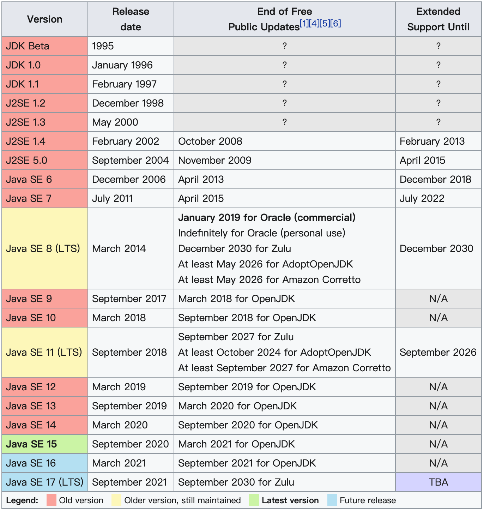
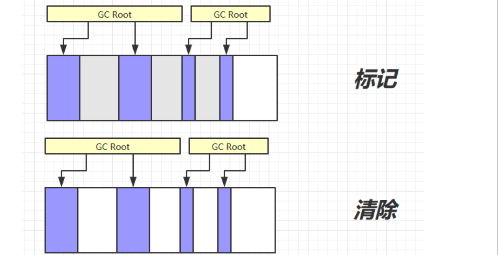

# 写在前面

## 推荐

### 视频

[尚硅谷宋红康JVM全套教程（详解java虚拟机）](https://www.bilibili.com/video/BV1PJ411n7xZ?p=1)

- 内存与垃圾回收篇
- 字节码与类的加载篇
- 性能监控与调优篇

### 书籍

《offer 来了》

## 总结（核心点简述）

# 内存与垃圾回收篇

## 1 JVM与Java体系结构

### 1.1 前言

你是否也遇到过这些问题？

- 运行着的线上系统突然卡死，系统无法访问，甚至直接OOM

- 想解决线上JVM GC问题，但却无从下手
- 新项目上线，对各种JVM参数设置一脸茫然，直接默认吧然后就JJ了
- 每次面试之前都要重新背一遍JVM的一些原理概念性的东西，然而面试官却经常问你在实际项目中如何调优VM参数，如何解决GC、OOM等问题，一脸懵逼

大部分Java开发人员，除会在项目中使用到与Java平台相关的各种高精尖技术，对于Java技术的核心Java虚拟机了解甚少。

 

我们为什么要学习JVM？

- 面试的需要（BATJ、TMD，PKQ等面试都爱问）
- 中高级程序员必备技能
  - 项目管理、调优的需求
- 追求极客的精神
  - 比如：垃圾回收算法、JIT、底层原理

垃圾收集机制为我们打理了很多繁琐的工作，大大提高了开发的效率。但是，垃圾收集也不是万能的，懂得JVM内部的内存结构、工作机制，是设计高扩展性应用和诊断运行时问题的基础，也是Java工程师进阶的必备能力。

### 1.2 参考书目

《深入理解Java 虚拟机》

### 1.3 Java及JVM简介

**TIOBE语言热度排行榜：**[**index | TIOBE - The Software Quality Company**](https://tiobe.com/tiobe-index/)

| Programming Language | 2021 | 2016 | 2011 | 2006 | 2001 | 1996 | 1991 | 1986 |
| -------------------- | ---- | ---- | ---- | ---- | ---- | ---- | ---- | ---- |
| C                    | 1    | 2    | 2    | 2    | 1    | 1    | 1    | 1    |
| Java                 | 2    | 1    | 1    | 1    | 3    | 26   | -    | -    |
| Python               | 3    | 5    | 6    | 8    | 27   | 19   | -    | -    |
| C++                  | 4    | 3    | 3    | 3    | 2    | 2    | 2    | 8    |
| C#                   | 5    | 4    | 5    | 7    | 13   | -    | -    | -    |
| Visual Basic         | 6    | 13   | -    | -    | -    | -    | -    | -    |
| JavaScript           | 7    | 8    | 10   | 9    | 10   | 32   | -    | -    |
| PHP                  | 8    | 6    | 4    | 4    | 11   | -    | -    | -    |
| SQL                  | 9    | -    | -    | -    | -    | -    | -    | -    |
| R                    | 10   | 17   | 31   | -    | -    | -    | -    | -    |
| Lisp                 | 34   | 27   | 13   | 14   | 17   | 7    | 4    | 2    |
| Ada                  | 36   | 28   | 17   | 16   | 20   | 8    | 5    | 3    |
| (Visual) Basic       | -    | -    | 7    | 6    | 4    | 3    | 3    | 5    |

世界上没有最好的编程语言，只有最适用于具体应用场景的编程语言

字节码

- 我们平时说的java字节码，指的是用java语言编译成的字节码。准确的说任何能在jvm平台上执行的字节码格式都是一样的。所以应该统称为：jvm字节码。

如何真正搞懂JVM？

- Java虚拟机非常复杂，要想真正理解它的工作原理，最好的方式就是自己动手编写一个！
- 天下事有难易乎？ 为之，则难者亦易矣；不为，则易者亦难矣
- 推荐书籍《自己动手写Java虚拟机》

### 1.4 Java发展的重大事件

### 1.5 虚拟机与Java虚拟机

Java虚拟机

- Java技术的核心就是Java虚拟机（JVM，Java Virtual Machine），因为所有的Java程序都运行在Java虚拟机内部。
- 作用：Java虚拟机就是二进制字节码的运行环境，负责**装载**字节码到其内部，**解释/编译**为对应平台上的机器指令执行。每一条Java指令，Java虚拟机规范中都有详细定义，如怎么取操作数，怎么处理操作数，处理结果放在哪里。

- 特点
  - 一次编译，到处运行
  - 自动内存管理
  - 自动垃圾回收功能

### 1.6 JVM的整体结构

- HotSpot VM是目前市面上高性能虚拟机的代表作之一。

- 它采用解释器与即时编译器并存的架构。

- 在今天，Java程序的运行性能早已脱胎换骨，已经达到了可以和C/C++程序一较高下的地步。

### 1.7 Java代码执行流程 ⭐️

### 1.8 JVM的架构模型

### 1.9 JVM的生命周期

#### 虚拟机的启动

Java虚拟机的启动是通过引导类加载器（bootstrap class loader）创建一个初始类（initial class）来完成的，这个类是由虚拟机的具体实现指定的。

#### 虚拟机的运行

- 一个运行中的Java虚拟机有着一个清晰的任务：执行Java程序。

- 程序开始执行时他才运行，程序结束时他就停止。

- **执行一个所谓的Java程序的时候，真真正正在执行的是一个叫做Java虚拟机的进程。**

#### 虚拟机的退出

有如下的几种情况：

- 程序正常执行结束

- 程序在执行过程中遇到了异常或错误而异常终止

- 由于操作系统出现错误而导致Java虚拟机进程终止

- 某线程调用Runtime类或system类的exit方法，或Runtime类的halt方法，并且Java安全管理器也允许这次exit或halt操作。

- 除此之外，JNI（Java Native Interface）规范描述了用JNI Invocation API来加载或卸载 Java虚拟机时，Java虚拟机的退出情况。

### 1.10 JVM的发展历程

后续补充。。。

主要以Oracle HotSpot VM为默认虚拟机。

## 2 类加载子系统

### 2.1 内存结构概述

- Class文件

- 类加载子系统

- 运行时数据区 （五大部分）

- - 方法区

- - 堆

- - 程序计数器

- - 虚拟机栈

- - 本地方法栈

- 执行引擎

- 本地方法接口

- 本地方法库

如果自己想手写一个Java虚拟机的话，主要考虑哪些结构呢？

- 类加载器

- 执行引擎

### 2.2 类加载器与类的加载过程

#### 类加载器子系统作用

- 类加载器子系统负责从文件系统或者网络中加载Class文件，class文件在**文件开头有特定的文件标识**。

- ClassLoader只负责class文件的加载，至于它是否可以运行，则由Execution Engine决定。

- 加载的类信息存放于一块称为方法区的内存空间。除了类的信息外，方法区中还会存放运行时常量池信息，可能还包括字符串字面量和数字常量（这部分常量信息是Class文件中常量池部分的内存映射）

#### 类加载器ClasLoader角色

快递员角色

- class file存在于本地硬盘上
- class file加载到JVM中，被称为DNA元数据模板，放在方法区。
- 实例化出多个实例

#### 加载阶段

#### 链接阶段

#### 初始化阶段

### 2.3 类加载器分类

JVM支持两种类型的类加载器 。分别为引导类加载器（Bootstrap ClassLoader）和自定义类加载器（User-Defined ClassLoader）。

无论类加载器的类型如何划分，在程序中我们最常见的类加载器始终只有3个，如下所示：

这里的四者之间的关系是包含关系。不是上层下层，也不是子父类的继承关系。

#### 虚拟机自带的加载器 ⭐️

##### 启动类加载器（引导类加载器，Bootstrap ClassLoader）

- 并不继承自ava.lang.ClassLoader，没有父加载器。
- 出于安全考虑，Bootstrap启动类加载器只加载包名为 `java`、`javax`、`sun`等开头的类

##### 扩展类加载器（Extension ClassLoader）

- 父类加载器为启动类加载器

##### 应用程序类加载器（系统类加载器，AppClassLoader）

- 父类加载器为扩展类加载器

- 该类加载器是程序中默认的类加载器，一般来说，Java应用的类都是由它来完成加载

### 2.4 ClassLoader 使用说明

ClassLoader类是一个抽象类，其后所有的类加载器都继承自ClassLoader（不包括启动类加载器）

### 2.5 双亲委派机制

Java虚拟机对class文件采用的是**按需加载**的方式，也就是说当需要使用该类时才会将它的class文件加载到内存生成class对象。

而且加载某个类的class文件时，Java虚拟机采用的是双亲委派模式，即把请求交由父类处理，它是一种任务委派模式。

#### 工作原理

- 1）如果一个类加载器收到了类加载请求，它并不会自己先去加载，而是把这个请求委托给父类的加载器去执行；

- 2）如果父类加载器还存在其父类加载器，则进一步向上委托，依次递归，请求最终将到达顶层的启动类加载器；

- 3）如果父类加载器可以完成类加载任务，就成功返回，倘若父类加载器无法完成此加载任务，子加载器才会尝试自己去加载，这就是双亲委派模式。
  - 父类加载器加载完成了，就不会向下委托

#### 优势

- 避免类的重复加载

- 保护程序安全，防止核心API被随意篡改 

- - 自定义类：java.lang.String

- - 自定义类：java.lang.ShkStart（报错：阻止创建 java.lang开头的类）

#### 沙箱安全机制

自定义String类，但是在加载自定义String类的时候会率先使用引导类加载器加载，而引导类加载器在加载的过程中会先加载jdk自带的文件（rt.jar包中java\lang\String.class），报错信息说没有main方法，就是因为加载的是rt.jar包中的string类。

这样可以保证对java核心源代码的保护，这就是沙箱安全机制。

## 3 运行时数据区之程序计数器（PC寄存器）

PC寄存器用来存储指向下一条指令的地址

字节码解释器工作时就是通过改变这个计数器的值来选取下一条需要执行的字节码指令。

它是唯一一个在Java虚拟机规范中没有规定任何OutofMemoryError情况的区域。

## 4 虚拟机栈 ⭐️⭐️⭐️⭐️⭐️

### 4.1 虚拟机栈概述

#### 虚拟机栈出现的背景

由于跨平台性的设计，Java的指令都是根据栈来设计的。不同平台CPU架构不同，所以不能设计为基于寄存器的。

**优点是跨平台，指令集小，编译器容易实现，缺点是性能下降，实现同样的功能需要更多的指令。**

#### 初步印象

有不少Java开发人员一提到Java内存结构，就会非常粗粒度地将JVM中的内存区理解为仅有Java堆（heap）和Java栈（stack）？为什么？

- 这种说法不全面。
- 栈和堆确实是最重要的2部分。
- C++中的类似观点。

#### 内存中的栈与堆

栈是运行时的单位，而堆是存储的单位。

- 栈解决程序的运行问题，即程序如何执行，或者说如何处理数据。

- 堆解决的是数据存储的问题，即数据怎么放，放哪里。

#### 虚拟机栈基本内容

##### Java虚拟机栈是什么？

- Java虚拟机栈（Java Virtual Machine Stack），早期也叫 Java 栈。

- 每个线程在创建时都会创建一个虚拟机栈，其内部保存一个个的**栈帧**（Stack Frame），对应着一次次的Java方法调用，是线程私有的。

##### 生命周期

生命周期和线程一致

## 5 本地方法接口和本地方法栈

## 6 堆 ⭐️⭐️⭐️⭐️⭐️

## 7 方法区

# 字节码与类的加载篇

# 性能监控与调优篇

# 1 JVM的运行机制

JVM（Java Virtual Machine）是用于运行Java字节码的虚拟机，包括一套字节码指令集、一组程序寄存器、一个虚拟机栈、一个虚拟机堆、一个方法区和一个垃圾回收器。JVM运行在操作系统之上，不与硬件设备直接交互。

 

Java程序的具体运行过程如下。

- Java源文件被编译器编译成**字节码文件**。
- JVM将字节码文件编译成**相应操作系统的机器码**。

- 机器码调用相应操作系统的**本地方法库执行相应的方法**。

 Java虚拟机如图所示：

其中：

- 类加载器子系统：用于将编译好的.Class文件加载到JVM中；

- 运行时数据区：用于存储在JVM运行过程中产生的数据，包括程序计数器、方法区、本地方法区、虚拟机栈和虚拟机堆；

- 执行引擎包括即时编译器和垃圾回收器：即时编译器用于将Java字节码编译成具体的机器码，垃圾回收器用于回收在运行过程中不再使用的对象；

- 本地接口库用于调用操作系统的本地方法库完成具体的指令操作。

# 2 所谓多线程

在多核操作系统上，JVM允许在一个进程内同时并发执行多个线程。

# 3 JVM的内存区域

JVM的内存区域分为线程私有区域（程序计数器、虚拟机栈、本地方法区）、线程共享区域（堆、方法区）和直接内存，如图所示。

线程私有区域的生命周期与线程相同，随线程的启动而创建，随线程的结束而销毁。

线程共享区域随虚拟机的启动而创建，随虚拟机的关闭而销毁。

## 3.1 程序计数器：线程私有，无内存溢出问题

程序计数器是一块很小的内存空间，用于存储当前运行的线程所执行的字节码的行号指示器。

程序计数器属于“线程私有”的内存区域，它是唯一没有Out Of Memory（内存溢出）的区域。

## 3.2 虚拟机栈：线程私有，描述**Java**方法的执行过程

栈帧用来记录方法的执行过程，在方法被执行时虚拟机会为其创建一个与之对应的栈帧，方法的执行和返回对应栈帧在虚拟机栈中的入栈和出栈。无论方法是正常运行完成还是异常完成（抛出了在方法内未被捕获的异常），都视为方法运行结束。

每个运行中的线程当前只有一个栈帧处于活动状态。

## 3.3 本地方法区：线程私有

本地方法区和虚拟机栈的作用类似，区别是虚拟机栈为执行Java方法服务，本地方法栈为Native方法服务。

## 3.4 堆：也叫作运行时数据区，线程共享

在JVM运行过程中**创建的对象和产生的数据**都被存储在堆中，堆是被**线程共享的内存区域**，也是**垃圾收集器进行垃圾回收的最主要的内存**

**区域**。

由于现代JVM采用**分代收集算法** ，因此Java堆从GC（GarbageCollection，垃圾回收）的角度还可以细分为：**新生代、老年代和永久代**。

## 3.5 方法区：线程共享

方法区也被称为永久代，用于**存储常量、静态变量、类信息、即时编译器编译后的机器码、运行时常量池等**数据

# 4 JVM的运行时内存（新生代+老年代+永久代）

JVM的运行时内存也叫作JVM堆，从GC的角度可以将JVM堆分为新生代、老年代和永久代。

- 其中新生代默认占 1/3堆空间，老年代默认占2/3堆空间，永久代占非常少的堆空间。

- 新生代又分为Eden区、ServivorFrom区和ServivorTo区，Eden区默认占8/10新生代空间，ServivorFrom区和ServivorTo区默认分别占 1/10新生代空间，

## 4.1 新生代：Eden**区、**ServivorTo**区和**ServivorFrom区（MinorGC）

JVM新创建的对象（除了大对象外）会被存放在新生代。

由于JVM会频繁创建对象，所以新生代会频繁触发MinorGC进行垃圾回收。

### Eden区

- Java新创建的对象首先会被存放在Eden区，如果新创建的对象属于大对象，则直接将其分配到老年代。
  - 大对象的定义和具体的JVM版本、堆大小和垃圾回收策略有关，一般为 2KB～128KB，可通过XX:PretenureSizeThreshold设置其大小。
- 在Eden区的内存空间不足时会触发MinorGC，对新生代进行一次垃圾回收。

### ServivorTo区

- 保留上一次MinorGC时的幸存者。

### ServivorFrom区

- 将上一次MinorGC时的幸存者作为这一次MinorGC的被扫描者。

 

新生代的GC过程叫作MinorGC，采用复制算法实现，具体过程如下。

（1）把在Eden区和ServivorFrom区中存活的对象**复制到ServivorTo区**。出现如下情况则将其复制到老年代：

- 如果某对象的年龄达到老年代的标准（对象晋升老年代的标准由XX:MaxTenuringThreshold设置，默认为 15）

- 如果ServivorTo区的内存空间不够
- 如果对象属于大对象（大小为 2KB～128KB的对象属于大对象，例如通过XX:PretenureSizeThreshold=2097152设置大对象为 2MB，1024×1024×2Byte=2097152Byte=2MB）

（2）**清空Eden区和ServivorFrom区**中的对象。

（3）将ServivorTo区和ServivorFrom区互换，原来的ServivorTo区成为下一次GC时的ServivorFrom区。

## 4.2 老年代（存放有长生命周期的对象和大对象）（MajorGC + 标记清除算法）

老年代主要存放有长生命周期的对象和大对象。

 

老年代的GC过程叫作MajorGC。在老年代，对象比较稳定，MajorGC不会被频繁触发。

在进行MajorGC前，**JVM会先进行一次MinorGC**，在MinorGC过后仍然出现老年代空间不足或无法找到足够大的连续空间分配给新创建的大对象时，会触发MajorGC进行垃圾回收，释放JVM的内存空间。

 

MajorGC采用标记清除算法，该算法首先会扫描所有对象并标记存活的对象，然后回收未被标记的对象，并释放内存空间。

因为要先扫描老年代的所有对象再回收，所以MajorGC的耗时较长。MajorGC的标记清除算法容易产生内存碎片。在老年代没有内存空间可分配时，会抛出Out Of Memory异常。

## 4.3 永久代

需要注意的是，在Java 8中永久代已经被元数据区（也叫作元空间）取代。元数据区的作用和永久代类似，二者最大的区别在于：元数据区并没有使用虚拟机的内存，而是直接使用操作系统的本地内存。因此，元空间的大小不受JVM内存的限制，只和操作系统的内存有关。

# 5 垃圾回收与算法

## 5.1 如何确定垃圾

Java采用引用计数法和可达性分析来确定对象是否应该被回收。

### （1）引用计数法

在Java中如果要操作对象，就必须先获取该对象的引用，因此可以通过引用计数法来判断一个对象是否可以被回收。

在为对象添加一个引用时，引用计数加 1；在为对象删除一个引用时，引进计数减 1；如果一个对象的引用计数为 0，则表示此刻该对象没有被引用，可以被回收。

 

引用计数法容易产生循环引用问题。循环引用指两个对象相互引用，导致它们的引用一直存在，而不能被回收

### （2）可达性分析

为了解决引用计数法的循环引用问题，Java还采用了可达性分析来判断对象是否可以被回收。

- 不可达
  - 首先定义一些GC Roots对象，然后以这些GC Roots对象作为起点向下搜索，如果在GC roots和一个对象之间没有可达路径，则称该对象是不可达的。

- 两次标记
  - 不可达对象要经过至少两次标记才能判定其是否可以被回收，如果在两次标记后该对象仍然是不可达的，则将被垃圾收集器回收。

## 5.2 Java中常用的4种垃圾回收算法

### （1）标记清除算法（快、但是存在碎片）

### （2）复制算法（无碎片、但要占用双倍内存空间）⭐️

### （3）标记整理算法（慢、无碎片）⭐️

### （4）分代收集算法

- 对象首先分配在伊甸园区域
- 新生代空间不足时，触发 minor gc，伊甸园和 from 存活的对象使用 copy 复制到 to 中，存活的对象年龄加 1并且交换 from to

- minor gc 会引发 stop the world，暂停其它用户的线程，等垃圾回收结束，用户线程才恢复运行

- 当对象寿命超过阈值时，会晋升至老年代，最大寿命是15（4bit）

- 当老年代空间不足，会先尝试触发 minor gc，如果之后空间仍不足，那么触发 full gc，STW的时间更长

# 6 Java中的4种引用类型

在Java中一切皆对象，对象的操作是通过该对象的引用（Reference）实现的。

Java中的引用类型有4种，分别为强引用、软引用、弱引用和虚引用。

## 强（最常见）

在把一个对象赋给一个引用变量时，这个引用变量就是一个强引用。

有强引用的对象一定为可达性状态，所以不会被垃圾回收机制回收。

因此，强引用是造成Java内存泄漏（Memory Link）的主要原因。

## 软（通过SoftReference类实现）

如果一个对象只有软引用，则在系统内存空间不足时该对象将被回收。

## 弱（通过WeakReference类实现）

如果一个对象只有弱引用，则在垃圾回收过程中一定会被回收。

## 虚（通过PhantomReference类实现）

虚引用和引用队列联合使用，主要用于跟踪对象的垃圾回收状态。

# 7 分代收集算法和分区收集算法

## 分代收集

JVM根据对象存活周期的不同将内存划分为新生代、老年代和永久代，并根据各年代的特点分别采用不同的GC算法。

- 新生代（1/3堆，复制算法）
  - 主要存储短生命周期的对象。
  - 因此在垃圾回收的标记阶段会标记大量已死亡的对象及少量存活的对象，因此只需选用复制算法将少量存活的对象复制到内存的另一端并清理原区域的内存即可。
- 老年代（2/3堆，标记整理算法）
  - 主要存放长生命周期的对象和大对象。
  - 可回收的对象一般较少，因此JVM采用标记整理算法进行垃圾回收，直接释放死亡状态的对象所占用的内存空间即可。

## 分区收集

分区算法将整个堆空间划分为连续的大小不同的小区域，对每个小区域都单独进行内存使用和垃圾回收，这样做的好处是可以根据每个小区域内存的大小灵活使用和释放内存。

# 8 垃圾收集器

# 9 Java网络编程模型

# 10 JVM的类加载机制

