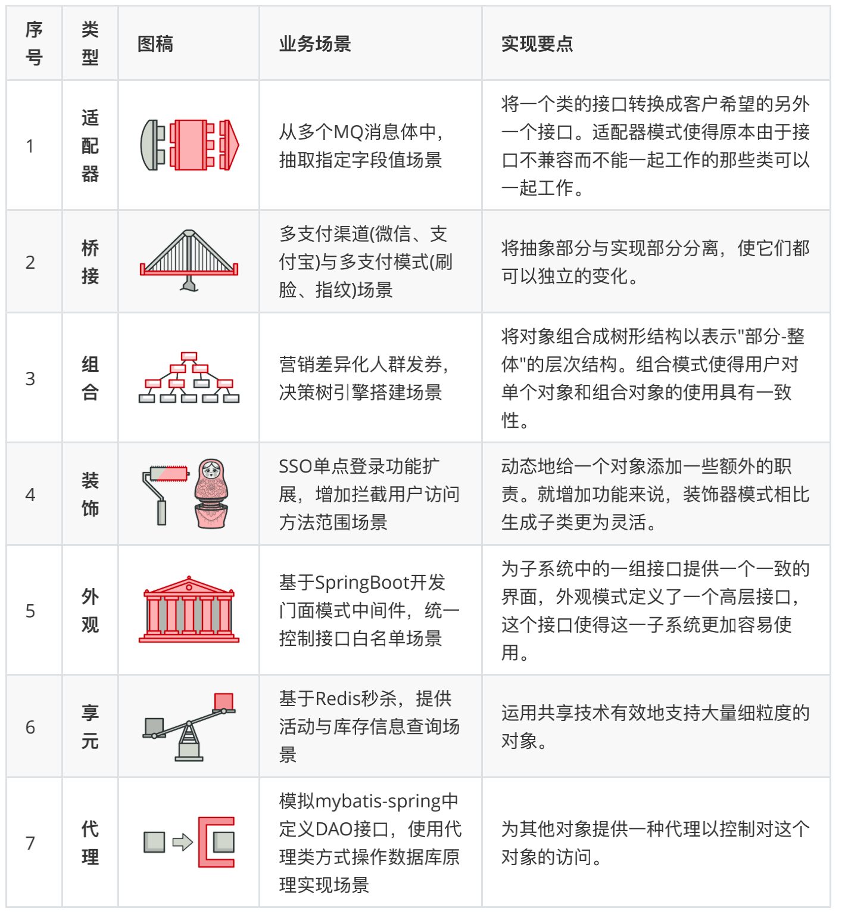

# 写在前面

## 推荐

https://refactoringguru.cn/

这是一本图文设计模式资料，里面的图稿非常助于理解

[菜鸟设计模式 - RUNOOB.COM](https://www.runoob.com/design-pattern/design-pattern-tutorial.html)

菜鸟设计模式属于比较简单的资料内容，比较适合还没有接触过设计模式的研发人员。

## 六大原则

设计模式遵循六大原则

- 单一职责（一个类和方法只做一件事）
- 里式替换（多态，子类可扩展父类）
- 依赖倒置（细节依赖抽象，下层依赖上层）
- 接口隔离（建立单一接口）
- 迪米特原则（最少知道，降低耦合）
- 开闭原则（抽象架构，扩展实现）

会在具体的设计模式章节中，进行体现。

# 创建者模式（5）

这类模式提供创建对象的机制， 能够提升已有代码的灵活性和可复用性。

创建者模式包括5类：工厂方法、抽象工厂、生成器、原型、单例。

 

# 结构型模式（7）

# 行为模式（10）

