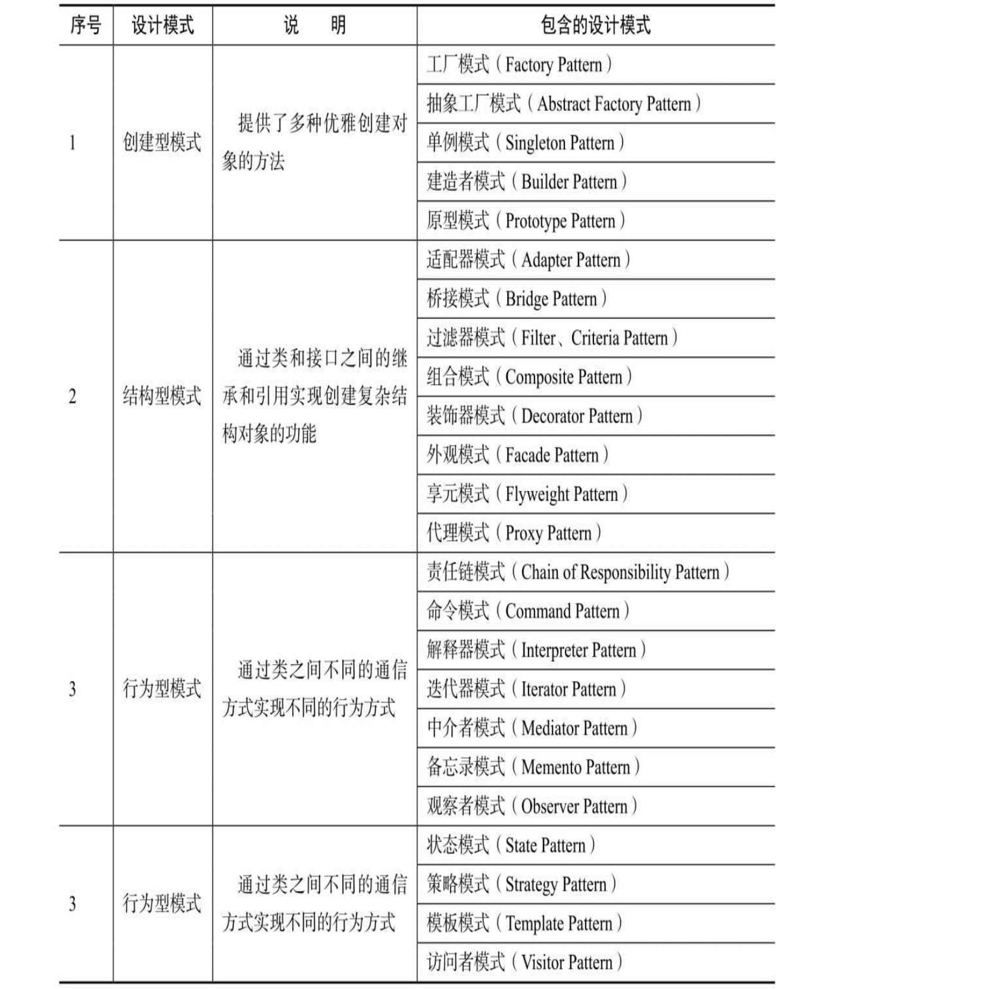

# 写在前面

## question

#### （1）你开发中都用到了什么设计模式？

#### （2）工厂模式的设计理念是什么？有什么好处？体现了什么编程思想？

#### （3）适配器模式了解吗？策略和适配器模式有什么区别，你为什么选择用策略模式而不是适配器原因是什么？


## 推荐

https://refactoringguru.cn/

这是一本图文设计模式资料，里面的图稿非常助于理解

[菜鸟设计模式 - RUNOOB.COM](https://www.runoob.com/design-pattern/design-pattern-tutorial.html)

菜鸟设计模式属于比较简单的资料内容，比较适合还没有接触过设计模式的研发人员。


## 六大原则

设计模式遵循六大原则

- 单一职责（一个类和方法只做一件事）
- 里式替换（多态，子类可扩展父类）
- 依赖倒置（细节依赖抽象，下层依赖上层）
- 接口隔离（建立单一接口）
- 迪米特原则（最少知道，降低耦合）
- 开闭原则（抽象架构，扩展实现）

会在具体的设计模式章节中，进行体现。





# 创建者模式（5）

这类模式提供创建对象的机制， 能够提升已有代码的灵活性和可复用性。

创建者模式包括5类：工厂方法、抽象工厂、生成器、原型、单例。

<br>


## 1 工厂方法模式（工厂类根据不同的参数创建不同的实例）

工厂模式在接口中定义了创建对象的方法，而将具体的创建对象的过程在子类中实现，用户只需通过接口创建需要的对象即可，不用关注

对象的具体创建过程。同时，不同的子类可根据需求灵活实现创建对象的不同方法。

（1）定义接口

```java
// 1 定义接口
public interface Phone {
    String brand();
}
```

（2）定义实现类

```java
// 2 定义实现类
public class Iphone implements Phone{
    @Override
    public String brand() {
        return "this is a apple iphone";
    }
}

// 2 定义实现类
public class Huawei implements Phone{

    @Override
    public String brand() {
        return "this is a huawei phone";
    }
}
```


（3）定义工厂类

```java
// 3 定义工厂类
// 根据不同的参数实例化不同品牌的手机类并返回

// 实现了：工厂类根据不同的参数创建不同的实例，对调用者来说屏蔽了实例化的细节。
public class PhoneFactory {

    public Phone createPhone(String phoneName) {
        if (phoneName.equals("Huawei")) {
            return new Huawei();
        } else if (phoneName.equals("Iphone")) {
            return new Iphone();
        } else {
            return null;
        }
    }
}
```


## 2 抽象工厂模式

抽象工厂模式（Abstract Factory Pattern）在工厂模式上添加了一个创建不同工厂的抽象接口 （抽象类或接口实现），该接口可叫作超级工厂。

在使用过程中，我们首先通过抽象接口创建出不同的工厂对象，然后根据不同的工厂对象创建不同的对象。


（1）第1类产品的手机接口及实现类的定义如下

```java
public interface Phone {
    String call();
}

public class PhoneApple implements Phone {
    @Override
    public String call() {
        return "call somebody by apple phone";
    }
}

public class PhoneHuawei implements Phone
{
    @Override
    public String call() {
        return "call somebody by huawei phone";
    }
}

```


（2）第1类产品的手机工厂类的定义如下

```java
public class PhoneFactory extends AbstractFactory {

    public Phone createPhone(String phoneName) {
        if (phoneName.equals("HuaWei")) {
            return new PhoneHuawei();
        } else if (phoneName.equals("Apple")) {
            return new PhoneApple();
        } else {
            return null;
        }
    }

    @Override
    public Computer createComputer(String brand) {
        return null;
    }
}
```

（3）第2类产品的电脑接口及实现类的定义如下

```java
public interface Computer {
    String internet();
}

public class ComputerApple implements Computer{
    @Override
    public String internet() {
        return "苹果电脑";
    }
}

public class ComputerHuawei implements Computer{
    @Override
    public String internet() {
        return "华为电脑";
    }
}
```

（4）第2类产品的电脑工厂类的定义如下

```java
public class ComputerFactory extends AbstractFactory {
    @Override
    public Phone createPhone(String brand) {
        return null;
    }

    @Override
    public Computer createComputer(String brand) {
        if ("HuaWei".equals(brand)) {
            return new ComputerHuawei();
        } else if ("Apple".equals(brand)) {
            return new ComputerApple();
        } else {
            return null;
        }
    }
}
```

（5）抽象工厂的定义如下

```java
//用户在需要手机时调用其createPhone()构造一个手机（华为或者苹 果品牌）即可，
// 用户在需要电脑时调用其createComputer()构造一个电脑（华为或者苹果品牌）即可。
public abstract class AbstractFactory {

    public abstract Phone createPhone(String brand);
    public abstract Computer createComputer(String brand);
}
```

（6）使用抽象工厂

```java
public class Test {
    // 使用工厂类
    // 在需要生产产品时，首先需要定义一个抽象的工厂类AbstractFactory，
    // 然后使用抽象的工厂类生产不同的工厂类，最终根据不同的工厂生产不同的产品。
    public static void main(String[] args) {

        // 工厂类1
        AbstractFactory phoneFactory = new PhoneFactory();
        Phone apple = phoneFactory.createPhone("Apple");
        Phone huaWei = phoneFactory.createPhone("HuaWei");
        System.out.println(apple.call());
        System.out.println(huaWei.call());

        // 工厂类2
        AbstractFactory computerFactory = new ComputerFactory();
        Computer computerApple = computerFactory.createComputer("Apple");
        Computer computerHuaWei = computerFactory.createComputer("HuaWei");
        System.out.println(computerApple.internet());
        System.out.println(computerHuaWei.internet());
        }
}
```


## 3 建造者模式

建造者模式（Builder Pattern）使用多个简单的对象创建一个复杂的对象，用于将一个复杂的构建与其表示分离，使得同样的构建过程可以创建不同的表示，然后通过一个Builder类（该Builder类是独立于其他对象的）创建最终的对象。


注意，建造者模式与工厂模式的最大区别是，建造者模式更关注**产品的组合方式和装配顺序**，而工厂模式关注产品的**生产本身**。


## 4 原型模式

原型模式指通过调用原型实例的Clone方法或其他手段来创建对象。


## 5 单例模式

单例模式是保证系统实例唯一性的重要手段。

单例模式首先通过将类的实例化方法私有化来防止程序通过其他方式创建该类的实例，然后通过提供一个全局唯一获取该类实例的方法帮助用户获取类的实例，用户只需也只能通过调用该方法获取类的实例。

单例模式的常见写法有懒汉模式（线程安全）、饿汉模式、静态内部类、双重校验锁，下面一一解释这些写法。

### 懒汉模式（线程安全）

定义一个私有的静态对象instance，之所以定义instance为静态，是因为静态 属性或方法是属于类的，能够很好地保障单例对象的唯一性；

然后定义一个加锁的静态方法获取该对象，如果该对象为null，则定义一个对象实例并将其赋值给instance，这样下次再获取该对象时便能够直接获取了。

懒汉模式在获取对象实例时做了加锁操作，因此是线程安全的，代码如下：

```java
public class LazySingleton {

    // 定义一个私有的静态对象
    private static LazySingleton instance;

    public LazySingleton() {
    }

    // 懒汉模式在获取对象实例时做了加锁操作，因此是线程安全的
    public static synchronized LazySingleton getInstance() {
        if (instance == null) {
            instance = new LazySingleton();
        }
        return instance;
    }
}
```


### 饿汉模式

饿汉模式指在类中直接定义全局的静态对象的实例并初始化，然后提供一个方法获取该实例对象。

在饿汉模式下，在Class Loader完成后该类的实例便已经存在于JVM中了

```java
public class HungrySingleton {
    
    // 饿汉模式是在定义单例对象的同时将其实例化的，直接使用便可。
    // 也就是说，在饿汉模式下，在Class Loader完成后该类的实例便已经存在于JVM中了
    private static HungrySingleton instance = new HungrySingleton();

    public HungrySingleton() {
    }
    public static HungrySingleton getInstance() {
        return instance;
    }
}
```


### 静态内部类

静态内部类通过在类中定义一个静态内部类，将对象实例的定义和初始化放在内部类中完成， 我们在获取对象时要通过静态内部类调用其单例对象。

之所以这样设计，是因为类的静态内部类在JVM中是唯一的，这很好地保障了单例对象的唯一性，代码如下

```java
// 之所以这样设计，是因为类的静态内部类在JVM中是唯一的，这很好地保障了单例对象的唯一性
public class Singleton {

    // 在类中定义一个静态内部类，将对象实例的定义和初始化放在内部类中完成
    private static class SingletonHolder {
        private static final Singleton INSTANCE = new Singleton();
    }

    public Singleton() {
    }

    public static final Singleton getInstance() {
        return SingletonHolder.INSTANCE;
    }
}
```


### 双重校验锁

双锁模式指在懒汉模式的基础上做进一步优化，给静态对象的定义加上volatile锁来保障初始化时对象的唯一性，在获取对象时通过synchronized (Singleton.class)给单例类加锁来保障操作的唯一性。代码如下

```java
public class Lock2Singleton {

    private volatile static Lock2Singleton singleton;//对象锁

    public Lock2Singleton() {
    }
    public static Lock2Singleton getInstance() {
        if (singleton == null) {
            synchronized (Lock2Singleton.class){//方法锁
                if (singleton == null){
                    singleton = new Lock2Singleton();
                }
            }
        }
        return singleton;
    }
}
```


# 结构型模式（7）


## 6 适配器模式


## 7 桥接模式

## 8 组合模式

## 9 装饰器模式

## 10 外观模式

## 11 享元模式

## 12 代理模式⭐️

在代理模式下有两种角色，一种是被代理者，一种是代理（Proxy），在被代理者需要做一项 工作时，不用自己做，而是交给代理做。


# 行为模式（10）


## 13 责任链模式


## 14 命令模式

## 15 迭代器模式

## 16 中介者模式

## 17 备忘录模式

## 18 观察者模式

## 19 状态模式

## 20 策略模式

## 21 模板模式

## 22 访问者模式


